Science at Advanced Level

(Optional)

# Grade 9

## 2026-27

Academic Unit,

Central Board of Secondary Education

Integrated Office Complex, Sector-23, Phase - 1, Dwarka, New Delhi - 110077

1

##### Table of Contents

###### S. No. Chapters Pages

- 1. Measurement – Foundation of Science 4-8
- 2. Understanding Motion through Experience 9-14
- 3.

Newton’s Laws of Motion 15-24

- 4.

The Geometry of Power – Advanced Simple Machines

25-29

- 5.

Work and Energy 30-33

- 6.

Structure of Atom 34-41

- 7.

Chemical Bonding 42-48

- 8.

Mixtures and their Separation 49-53

- 9.

Microscope and Microscopy 54-69

- 10.

Engineering Life: Miracles in Biotechnology 69-86

#### Content Development Committee

Mr. Aishwary Meet, Physics Expert, Gaur International School, Noida Ms. Alka Gupta, TGT Science, Mayoor School, Sector-126, Noida Dr. Amit Sehgal, Professor, Hansraj College, University of Delhi Dr. Anita Verma, Retired Professor, Kirori Mal College, University of Delhi Ms. Cenkush Sharma, TGT, Vandana International School, Dwarka, Delhi Ms. Geetanjali Padhy, Biology Educator, Suncity School, Sector-54, Gurugram Dr. Girish Choudahry, Retd. Associate Professor, Lady Irwin College, University of Delhi Professor K.K Arora, Professor, Zakir Husain College, University of Delhi Ms. Mridula Arora, Head of School, Navayug School, Sarojini Nagar, New Delhi Ms. Pamila Marwaha, PGT Chemistry, Navayug School, Sarojini Nagar, New Delhi Dr. Renu Parashar, Professor, Hansraj College, University of Delhi Dr. Sanjeev, Professor, IGNOU Ms. Shivani Kaplish, TGT Science, Mayoor School, Sector-126, Noida Ms. Varsha Krishnan, TGT, Bal Bharati Public School, Rohini, Delhi

|Measurement- The Foundation of Science  |
|---|

- 1.1 Introduction: What is Measurement? Measurement is the process of comparing an unknown quantity with a known standard quantity of the same kind. Physics is based on measurement. Whether we measure the length of a classroom, the mass of a bag, or the time taken by a runner, accurate measurement is essential Examples

- ● A tailor measures cloth in meters.
- ● A doctor measures body temperature in degree Celsius.
- ● A shopkeeper measures rice in kilograms.

Without proper units, these measurements would have no meaning.

- Activity 1.1 Measuring the area of the classroom floor Materials: Take three sticks of length l1:l2:l3 = 1:2:3 Procedure:

- 1. Divide students in 3 groups and hand over one stick to each group.
- 2. Each group will measure the length and width of the classroom taking stick as one unit.

| |Stick 1|Stick 2|Stick 3|
|---|---|---|---|
|Length of wall|……… units*|……… units|……… units|
|Breadth of wall|……… units|……… units|……… units|
|Area of floor|……… units2|……… units2|……… units2|

*the unit refers to length of the stick used for measurement

- 3. Compare the length, breadth and area measured by different groups and try to generate conclusions between unit chosen and numerical values obtained by all the three groups.

This activity demonstrates that the numerical value of a quantity is inversely proportional to the size of the unit used. Thus, when a larger unit (longer stick) is used to measure the classroom floor, the numerical value obtained is smaller, and

when a smaller unit is used, the numerical value is larger.

|In measurement, the physical quantity remains constant even when the unit changes. Hence,  Q = n₁u₁ = n₂u₂ Therefore,  n₂ = n₁ (u₁ / u₂)|
|---|

- Activity 1.2: Let’s play an estimation game Procedure:

- 1. Estimate the length of the blackboard without measuring.
- 2. Then measure its length using a meter scale.
- 3. Compare the estimated and measured values. Now, calculate the inaccuracy (error) in the measurement.

##### 1.2 Different Systems of Units

In earlier times, different regions/places used their own units of measurement, which often led to confusion and errors.

- (a) CGS System

- ● Length: centimeter (cm)
- ● Mass: gram (g)
- ● Time: second (s)

It is mainly used in laboratory and scientific calculations.

- (b) FPS System

- ● Length: foot (ft)
- ● Mass: pound (lb)
- ● Time: second (s)

Commonly used in the United States.

- (c) MKS System

- ● Length: meter (m)
- ● Mass: kilogram (kg)
- ● Time: second (s)

This system later developed into the SI (International System of Units or Système International d'Unités) system.

Example

● The height of a person is largely measured in centimeters in India, while in some countries it is measured in feet and inches.

##### 1.3. Need for a Common System of Units

Different systems of units caused difficulties in communication, trade, and scientific research.

Problems Without a Common System

- ● Confusion in international trade
- ● Errors in scientific calculations
- ● Difficulty in sharing scientific data Example If a scientist in India measures length in meters and another in the USA measures in feet, comparison becomes difficult unless a common unit is used. Hence, a universal system of units was required.

- Activity 1.3: Let us Compare Materials: Ruler marked in cm and inches Procedure:

- 1. Measure the length of a book using both cm and inches.
- 2. Compare the values and find the relation between them.

##### 1.4. International System of Units (SI)

The International System of Units (SI) is the modern and universally accepted system of measurement.

SI Base Units

|Physical Quantity|SI Unit|Symbol|
|---|---|---|
|Length|Meter|m|
|Mass|Kilogram|kg|
|Time|Second|s|
|Temperature|Kelvin|K|
|Electric Current|Ampere|A|

|Luminous Intensity|Candela|Cd|
|---|---|---|
|Amount of substance|Mole|mol|

Advantages of SI Units

- ● Internationally accepted
- ● Easy to use and understand
- ● Based on the decimal system

Examples

- ● Speed of vehicles is measured in m/s or km/h
- ● Medicines are measured in milligrams (mg)

##### 1.5 Conversion of Units between different Systems

Sometimes, we need to convert a measurement from one unit to another to ensure comprehension across different systems.

During unit conversion, the numerical value and the unit may change, but the magnitude of the physical quantity remains the same.

Basic Conversions

- ● 1 km = 1000 m
- ● 1 m = 100 cm
- ● 1 kg = 1000 g
- ● 1 hour = 3600 s

Examples Q. Convert 9 km/hr into m/s. Answer: 9 km/hr =  ×        = m/s Q. Convert 1 N into gcm/s2. Answer: 1 kg m/s 2 = 1000g x 100 cm/s2 = 105 gcm/s2 = 105 dyne.

Quick Check

- 1. Name any two systems of units.
- 2. Why is SI system preferred over other systems?
- 3. Convert 250 N into gcm/s2.
- 4. Convert 1000 kg/L into kg/m3.

Check Your Understanding

- 1. Which of the following is not an SI unit?

- a) Meter
- b) Kilogram
- c) Second
- d) foot

- 2. The SI unit of mass is:

- a) Gram
- b) Kilogram
- c) Pound
- d) tonne

- 3. Name the system of units used internationally.
- 4. Why is a common system of units necessary?
- 5. Why is measurement necessary in physics?
- 6. Why was there a need for a common system of units?
- 7. Explain the relation: Magnitude = Numerical value × Unit
- 8. Why does the same classroom floor give different numerical values when measured with sticks of different lengths?

Answer questions 9 to 11 that are based on Activity 1.1 (Measuring Classroom Floor)

Suppose:

|Stick Length|Length of Wall|Breadth of Wall|
|---|---|---|
|1 unit|30 units|20 units|
|2 units|15 units|10 units|
|3 units|10 units|6.6 units|

- 9. Why are numerical values different?
- 10. Is the actual size of the classroom different? Why or Why not?
- 11. What conclusion can you draw about units and measurement from this activity?
- 12. Fill in the blanks

- a. Measurement is the process of comparing an unknown quantity with a __________ quantity.
- b. The SI unit of mass is __________.

- c. In CGS system, the unit of length is __________.
- d. 1 km = __________ m.
- e. The modern internationally accepted system of units is called __________.

- 13. Match the following:

|Column A|Column B|
|---|---|
|CGS|Kelvin|
|FPS|Pound|
|SI|International system|
|MKS|Meter-Kilogram-Second|

- 14. What problems might occur if every country used its own system of units for measurement?
- 15. A scientist measures length in feet and another in meters. What difficulties may it lead to?
- 16. If 1 meter was defined differently in different countries, what would happen to international trade?
- 17. A shopkeeper sells rice using kilograms. A foreign customer asks for rice in pounds.

- a. Why is unit conversion necessary here?
- b. If 1 kg = 2.2 pounds, how many pounds are there in 5 kg?

************************************************************************************************

|Understanding Motion Through Experience|
|---|

Reflect on the following:

- ● Why do we feel pushed backward when a bus suddenly starts moving?
- ● Can an object be at rest for one observer but moving for another?
- ● How do athletes decide the best angle to throw a ball so that it travels the maximum distance?
- ● Can we measure motion using simple tools available in the classroom?

Discuss your ideas with classmates before beginning the activities.

##### 2.1 What is Motion?

An object is said to be in motion if its position changes with time with respect to a reference point. Motion can be slow or fast, straight or curved, uniform or non‑uniform. Understanding motion becomes easier when we observe it directly and measure it ourselves.

- Activity 2.1: Let’s observe Materials: Notebook, stopwatch (mobile timer), measuring tape Steps:

- 1. Mark two points 5 meters apart in the classroom corridor or playground.
- 2. Ask one student to walk normally from one point to another while another student measures the time taken using a stopwatch.
- 3. Repeat the experiment with the student running.
- 4. Record the distance and time in a table.

Observation: - Compare the time taken for walking and running. - Which motion is faster? How can you calculate speed? Can motion be described using measurable quantities such as distance and time?

##### 2.2 Frame of Reference

A frame of reference that is at rest or moving with constant velocity is called an inertial frame. Newton’s laws hold without modification in such frames. A frame that is accelerating is called a non-inertial frame, and we will see in later sections that special corrections (pseudo forces) become necessary in such frames.

To describe the state of motion of an object, we must specify a reference point. Without it, we cannot say whether an object is moving or at rest.

- Activity 2.2: Motion is Relative Materials: Two students as props Steps:

- 1. Let one student stand still while another walks past him.
- 2. Ask each student to describe the motion of the other student.
- 3. Now let both students walk in the same direction with the same speed and describe the motion again.

Discussion: - When both students walk together at the same speed, they appear at rest relative to each other but moving relative to the classroom.

2.3. Scalars and Vectors

Physical quantities are of two types: Scalars: Quantities having magnitude only (distance, time, mass, speed and work) Vectors: Quantities having both magnitude and direction (displacement, velocity, force).

- Activity 2.3: Direction Matters Materials: Chalk, measuring tape Steps:

- 1. Draw a straight 5‑metre line on the ground and mark the starting point as A and the end as B.
- 2. Walk from A to B and note the distance covered.
- 3. Next walk from A to B and then back to A.
- 4. Compare the distance travelled and displacement.

Observation: - Distance changes but displacement becomes zero when returning to the starting point.

##### 2.4 Vector Addition (Graphical Method)

Vectors are physical quantities that have both magnitude and direction, such as displacement, velocity, and force. When two or more vectors act together, we combine them to find a single vector called the resultant. This process is known as vector addition. Vectors can be added graphically using methods like the triangle method or the parallelogram method.

- Activity 2.4: Graphical Addition of Displacements Materials: Graph paper, ruler, pencil Steps:

- 1. On graph paper, draw a vector representing 4 units towards the east.
- 2. From the head (end) of this vector, draw another vector representing 3 units towards the north.
- 3. Now join the tail (starting point) of the first vector to the head of the second vector.

Observation: The line joining the starting point to the final point represents the resultant displacement.

This is how two vectors can be combined graphically to find a resultant vector, and how both magnitude and direction are important in describing motion.

Practice Question:

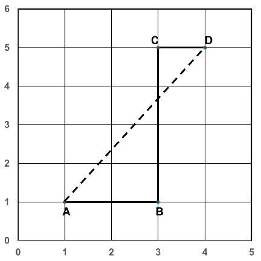

Points A at (1,1), B at (3,1) , C at (3,5) and D at (4,5) (All the values mentioned in the graph are in km) represent Sita’s House, bus stop, traffic signal and school respectively. In the morning Sita travels from A to B on foot, then B to D via C in the school bus. (All the values mentioned in graph are in km) Then calculate:

- (a) Distance traveled by Sita on foot,
- (b) Distance traveled by Sita by the school bus,
- (c) Total displacement of Sita from her house to the school.

##### 2.5. Equations of Motion

When an object moves with constant acceleration, its motion can be described using equations which are given as:

V = u + at S = ut + 𝑎𝑡2 v² = u² + 2as

where, u is initial velocity, v is final velocity, a is acceleration, and s is displacement.

- Activity 2.5: Observing Accelerated Motion Using a Toy Car

Materials: Toy car (or small wheeled object), smooth floor, measuring tape, stopwatch (mobile timer), chalk/tape

Steps:

- 1. Mark a straight line on the floor and label the starting point as O.
- 2. Place the toy car at point O and give it a gentle push so that it moves forward.
- 3. Use a stopwatch and note the position of the car at equal time intervals (every 1 second).
- 4. Mark these positions on the floor using chalk or tape.
- 5. Measure the distance from the starting point to each marked position and record it in a table.

Observation: The distance travelled in successive intervals increases, showing

acceleration. Conclusion: The motion is accelerated motion, as the velocity increases with time.

4th equation of motion distance travelled in the 𝑛 second From the second equation of motion:

- 1
- 2

𝑎𝑡 where,

𝑠 = 𝑢𝑡 +

𝑢= initial velocity 𝑎= acceleration 𝑡= time 𝑠= displacement in time 𝑡

Distance travelled in 𝑛 seconds 𝑠 = 𝑢(𝑛) +

- 1
- 2

𝑎𝑛 Distance travelled in (1) second

𝑠 = 𝑢(𝑛 − 1) + 𝑎(𝑛 − 1) Distance travelled in the 𝑛 second

- 1
- 2

- 1
- 2

𝑎(𝑛 − 1) Solving:

𝑑𝑖𝑠𝑡𝑎𝑛𝑐𝑒 𝑖𝑛 𝑛 𝑠𝑒𝑐𝑜𝑛𝑑 = 𝑠 − 𝑠 =

𝑎𝑛 −  𝑢(𝑛 − 1) +

- 1
- 2

- 1
- 2

- 1
- 2

𝑎[2𝑛 − 1] Final Formula

= 𝑢𝑛 +

𝑎𝑛 − 𝑢𝑛 + 𝑢 −

𝑎(𝑛 − 2𝑛 + 1) = 𝑢 +

𝑎 2

𝑠 = 𝑢 +

(2𝑛 − 1)

This is the distance travelled in the 𝑛 second, often called the fourth equation of motion. Here n must be a positive integer representing the nth second of motion. The formula gives the displacement specifically during that one-second interval, not a cumulative displacement.

##### 2.6 Reflect and Discuss

- ● Why is specifying a reference frame necessary to describe motion?
- ● How do direction and magnitude together describe displacement?
- ● Which daily activities around you involve accelerated motion?

##### 2.7 Project-Based Learning

Design a simple experiment using everyday materials to measure the speed of a moving object (using a bicycle, or a walking student). Present your method, observations, calculations, and conclusions to the class.

Check Your Understanding

- 1. Define a frame of reference in your own words.
- 2. Give two real-life examples where motion depends on the observer.
- 3. Why does a person sitting in a moving train appear at rest to another passenger?
- 4. Classify the following as scalar or vector quantities: speed, velocity, displacement, distance, acceleration and mass.

- 5. Explain the difference between distance and displacement with an activity diagram.
- 6. Give two everyday examples of vector quantities.
- 7. Draw two vectors of 4 units east and 3 units north and find the resultant using the triangle method.
- 8. Explain how vector subtraction is performed graphically.
- 9. Draw two opposite vectors of equal magnitude. Calculate its resultant.
- 10. A body starts from rest and accelerates at 4 m/s². Find the distance travelled in the 6th second.
- 11. A car with initial velocity 8 m/s accelerates at 2 m/s². Find the distance covered in the 5th second.

************************************************************************************************

|Newton’s Laws of Motion|
|---|

##### 3.1 Limitations of Newton’s Laws in Accelerating Frames

- Activity 3.1: Let us observe Consider the following situations:

- ● A passenger standing in a bus that suddenly accelerates forward feels pushed backward, even though no one is actually pushing.
- ● When a vehicle takes a sharp turn, passengers feel pushed outward.

Why does this happen? Is there really a force pushing the passenger backward or outward? Can these effects be explained only by the usual forces like gravity or friction?

###### Understanding the Limitations

According to Newton’s First Law of Motion, a body continues to remain at rest or in uniform motion in a straight line unless acted upon by an external force. This law is strictly valid only in a non-accelerating frame.

However, when the frame itself is accelerating, objects seem to move without any visible external force acting on them.

To maintain consistency with Newton’s laws, let us examine an additional concept.

###### Pseudo Force (Fictitious Force)

A force which does not arise due to physical contact or interaction (unlike gravitational, frictional, or tension forces). A pseudo force (also called a fictitious force) is an apparent force that is observed only when motion is described from an accelerating frame of reference.

Now understanding the scenario: What does a passenger fall backwards when a bus starts suddenly?

- Observer 1: Standing on the road (inertial frame)

- ● Sees the bus accelerate forward
- ● Sees the passenger trying to remain at rest (inertia)

Explanation uses only real physics:

- ● No backward force exists
- ● Passenger’s body just resists motion

This follows Newton’s First Law of Motion perfectly.

- Observer 2: Inside the accelerating bus (non-inertial frame)

- ● Sees the passenger “move backward”
- ● But doesn’t see any real force causing it

To make Newton’s Laws of Motion still work, we introduce the concept of pseudo force: From the ground (an inertial frame), no force pushes the passenger backward — the bus simply accelerates away from under them. But if we describe the situation from inside the accelerating bus (a non-inertial frame), we must add a pseudo force of magnitude m*a directed backward to make Newton’s First Law appear valid within that frame. This force has no physical source and no reaction pair.

When a frame accelerates forward, it exerts an influence on objects inside it. From within that accelerating frame, we introduce an imaginary force acting in the opposite direction to explain the observed motion. Thus, in an accelerating frame:

- ● The frame accelerates in one direction.
- ● An apparent force (pseudo force) is considered to act on the body in the

opposite direction. This ensures that Newton’s First Law still appears valid within that frame. Definition:

A pseudo force is an apparent force observed only in an accelerating frame of reference. It is always opposite to the acceleration of the frame and does not arise due to any physical interaction.

Formula

𝐹𝒑𝒔𝒆𝒖𝒅𝒐 = −𝑚𝑎𝒇𝒓𝒂𝒎𝒆 where:

- ● 𝑚= mass of the object
- ● 𝑎 = acceleration of the frame
- ● The negative sign indicates that the pseudo force acts opposite to the acceleration of the frame.

Quick Check

- 1. In which type of reference frame are Newton’s laws valid?
- 2. Define pseudo force and write its formula.
- 3. A lift accelerates upward at 4.5𝑚 𝑠 . Calculate the pseudo force experienced by a 60 kg person inside the lift.
- 4. Why does pseudo force disappear in an inertial frame?

- 3.2 Gravitation Orbital Motion: Why the Earth and Moon Do Not Fall Despite Gravity?

###### Concept of Centripetal and Centrifugal forces

The Sun and the Earth both have mass, so they attract each other with a gravitational force. According to Newton’s law of gravitation, the force between them is equal in magnitude and opposite in direction. However, because the Sun’s mass is much greater than the Earth’s mass, the Earth experiences a much larger acceleration as compared to the Sun. That is why the Earth appears to revolve around the Sun.

The Sun’s gravitational pull on the Earth provides the centripetal force needed to keep the Earth in its orbit.

Earth is revolving around the Sun and it is moving with very high tangential velocity. So, due to its inertia, it should tend to continue moving in a straight line. On the other hand, the gravitational force of the sun is continuously attracting it towards the centre of the sun. This changes its direction of motion. As a result of these two aspects, the Earth does not move in a straight line but follows a fixed curved path called an orbit.

Let us think: Imagine the Earth suddenly slows down. Take a moment to picture what would happen if its forward (tangential) speed decreases, but the Sun’s gravitational pull remains just as strong as before. Would the balance still exist? How would this change affect the Earth’s path? Think about why slowing down would cause the Earth to drift closer to the Sun instead of continuing smoothly along its usual orbit.

Try to get the answer with the help of the following activity.

- Activity 3.2: Steps:

- 1. Tie the ring/bob securely to one end of the thread of length approx. 1 m.
- 2. Hold the other end of the thread firmly with your finger.
- 3. Swing the ring/bob in a horizontal circle at a steady speed.

- 4. Observe how the bob moves in a circular path.
- 5. Now slowly reduce the speed of rotation.
- 6. Continue decreasing the speed further and observe what happens to the circular motion.

Observation:

At an appropriate speed, the thread provides the centripetal force that pulls the stone/ bob inward, keeping it in a circular path. At the same time, due to its inertia, the stone tends to move in a straight line along the tangent. The balance between this outward tendency and the inward centripetal force results in circular motion.

When the speed decreases, the required centripetal force also decreases. However, the tension in the thread may reduce to the point where it can no longer keep the stone moving in a circular path. As a result, the string may become slack, and the motion is no longer circular—the stone begins to move inward or fall.

Conclusion:

Circular motion requires a balance between inward pulling force (centripetal force) and tangential speed (which provides necessary centrifugal force). If speed decreases too much, the balance is disturbed, and the object can no longer continue in the same circular path.

###### Effect of Cross-Sectional Area (Air Resistance) on Falling Objects of Equal Mass

Let us imagine two objects with the same mass but different cross-sectional areas These are dropped from the same height, an important question arises: Will they reach the ground at the same time?

- Case 1: When Air Is Present

Both objects have the same mass, so the gravitational force acting on them is the same:

F = mg

Since mass (m) is the same, the force of gravity on both objects is equal. This means gravity pulls both objects downward equally.

However, another force also acts on the objects — air resistance (air drag). This is an upward force that opposes motion.

Air resistance mainly depends on the cross-sectional area of the object (and shape, speed and density of air). The larger the cross-sectional area, the greater the air resistance.

Because of this:

- ● The object with a larger cross-sectional area experiences more air resistance.
- ● The object with a smaller cross-sectional area faces less opposition.
- ● Therefore, it has a greater net downward force and falls faster.

Conclusion: In air, the object with the smaller cross-sectional area reaches the ground first.

- Case 2: In a Vacuum (No Air) Since there is no air in a vacuum, there is no air resistance either.

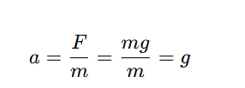

Conclusion: In a vacuum, both objects reach the ground at the same time, regardless of their shape or size.

###### Variation of acceleration due to Gravity with Altitude and Depth (without using Binomial Theorem)

- ● When we throw a ball upward, it comes back down.
- ● When we jump, we return to the ground.

This happens because the Earth pulls everything toward its centre due to gravity. But why do astronauts float inside a spacecraft? Does gravity disappear in space? Is the value of gravity the same everywhere?

We know that as we go higher above the Earth’s surface, we move farther away from the centre of the Earth. We know that gravitational force depends on distance.

- As distance increases, force decreases. Astronauts in the International Space Station appear weightless. So clearly, gravity decreases with height, but it does not become zero.

Now let us derive the expression for the acceleration due to gravity at point A, which is at a height of h from the surface of the earth.

###### Derivation – Acceleration Due to Gravity at Height

Let:

- ● Mass of object = m
- ● Radius of Earth = R
- ● Height above surface = h
- ● Distance from centre of Earth = (R + h)

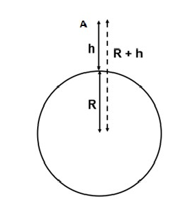

Fig: 3.1 Acceleration due to gravity at height h

The acceleration due to gravity at height h is:

Where:

𝐺𝑀 (ℎ)

𝑔 =

- ● G = Universal Gravitational Constant
- ● M = Mass of Earth On Earth’s surface:

Dividing both equations:

𝐺𝑀 𝑅

𝑔 =

This shows clearly that:

𝑔 𝑔

𝑅 (ℎ)

=

𝑔 < 𝑔

Example Calculate acceleration due to gravity at a height of 800 km above Earth. Given:

R = 6400 km h = 800 km g = 9.8 m/s²

𝑔 = 𝑔

𝑅 (ℎ)

𝑔 = 9.8

6400 7200

𝑔 = 9.8

64 72

𝑔 = 7.74 𝑚/𝑠

Acceleration Due to Gravity Below the Surface of Earth

Now, consider a point A located at a depth d inside the Earth. Assuming the Earth has uniform density, let us determine the acceleration due to gravity at that interior point. Let:

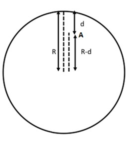

Fig: 3.2 Acceleration due to gravity at depth d

- ● Radius of Earth = R
- ● Depth below surface = d
- ● Distance from centre = (R − d)
- ● Density of Earth = ρ (uniform)

If density is uniform, then mass of the earth can be calculated by 𝑀𝑎𝑠𝑠 𝑜𝑓 𝐸𝑎𝑟𝑡ℎ = 𝑀 =

4 3

𝜋𝑅 𝜌

- At depth d, the object is at a distance (R − d) from the centre, only the mass inside radius (R − d) contributes to gravity. (This is By Newton’s Shell theorem, the gravitational effect of a uniform spherical shell on a point inside it is exactly zero. Therefore, at depth d, only the sphere of radius (R–d) centred at Earth’s core contributes to gravity— the outer shell of thickness d has no net effect)

4 3

𝜋(𝑅 − 𝑑) 𝜌 From Newton’s Law of Gravitation

𝑀 =

𝐺𝑀 (𝑑)

𝑔 =

Substitute 𝑀 :

4 3

𝐺

𝜋(𝑅 − 𝑑) 𝜌 

𝑔 =

(𝑑) 𝑔 =

4 3

𝜋𝐺𝜌(𝑅 − 𝑑)

Compare with gravity at earth’s surface i.e. At Earth’s surface:

4 3

𝜋𝐺𝜌𝑅 Dividing the two equations:

𝑔 =

𝑅 − 𝑑 𝑅 Therefore,

𝑔 𝑔

=

𝑔 = 𝑔

𝑑 𝑅

We conclude from the above derivations that acceleration due to gravity is maximum at the Earth’s surface and decreases as we go up/down. It will become zero at the centre of the earth.

Example: At what depth does g become 1/10th of its surface value? Given:

𝑔 10 Using the formula:

𝑔 =

𝑔

𝑑 𝑅

𝑔 10

𝑑 𝑅

=

1 −

1 10

=

𝑑 𝑅

- 9
- 10

- 9𝑅
- 10

=

𝑑 =

###### Quick Check

- 1. Where does the acceleration due to gravity reach its maximum value—on the surface, above, or below the Earth?
- 2. What happens to g at the centre of the Earth?
- 3. Calculate g at a height of 400 km if R = 6400 km.
- 4. At what depth will g become half of its surface value?
- 5. Why does gravity decrease both above and below the surface of the earth?

##### 3.3 Turning Forces (Moment of Force/Torque)

- Activity 3.3: Let us observe

Look at the picture of a boy trying to enter his classroom. He pushes the door to open it. Now, think carefully and answer the following questions:

- ● Where will the boy apply force to open the door easily?

(a) Near the handle (b) Near the hinges (c) At the centre of the door

- ● Why are door handles fixed far away from the hinges and not near them?

Now, reflect on the following points:

- ● The boy applies force in a straight direction, but the door rotates. Why does this happen?
- ● Even though the door is heavy, it rotates easily when pushed at the handle.
- ● How is it possible to rotate such a heavy object by applying force at just one end?

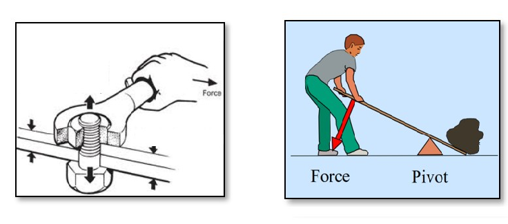

Fig: 3.3 Some examples of turning effects of forces in our daily life

When we apply a force to an object and it starts to rotate, the force produces a turning effect. This turning effect of a force is called the moment of force.

Moment of Force (Torque)τ = F × d × sin θ, where F is the magnitude of the force, d is the distance from the pivot to the point of application, and θ is the angle between the force and the line joining the pivot to the point of application. Torque is maximum when θ = 90° (force perpendicular to the lever arm) and zero when θ = 0° or 180° (force directed toward or away from the pivot).

Since the turning effect of a force depends on both the magnitude of the force and the distance from the fixed point, its S.I. unit is newton-metre (Nm).

The angle at which force is applied to a door (and the resulting angle of the door itself) is crucial for controlling the turning, efficiency, and safety of the opening motion. The fundamental principle is that turning is maximized when the force is applied perpendicular (at a 90-degree angle) to the door surface, making it the most efficient way to open or close it.

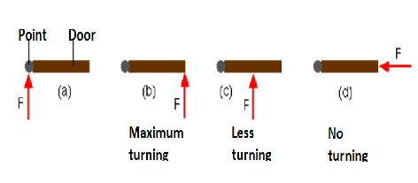

Check Your Understanding

- 1. Why is it easier to open a door when you push at the handle rather than near the hinges?
- 2. A force is applied to a wrench at different angles. At which angle will the rotating force be maximum? What happens to the turning effect when the force is applied parallel to the wrench?
- 3. Two students apply the same force to open a gate. One pushes perpendicular to the gate at 20cm from the hinge. The other pushes perpendicular to the gate at 80 cm. Who produces greater torque? Justify
- 4. Is it possible for a force to act on a body and still produce zero turning about a given fixed point? Give a real-life example.
- 5. Two forces act on a rod pivoted at its centre:

- I. 10 N downward at 0.5 m on the left
- II. 10 N downward at 0.5 m on the right Will the rod rotate? Explain your reasoning

- 6. How can a mechanic loosen a tight bolt using a long spanner instead of applying a very large force? Explain using the torque formula.
- 7. A force of 20 N is applied to a door at 0.8 m from the hinge. Calculate the torque when the force is applied at (a) 90°, (b) 60° (c) 30° to the door surface.

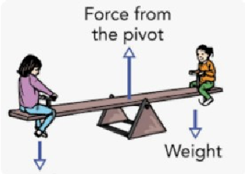

****************************************************************************************

|The Geometry of Power- Advanced Simple Machines  |
|---|

- 4.1 Introduction

Welcome to the study of Mechanical Advantage. While simple machines such as levers and inclined planes form the foundational concepts of physics, the machines that shape our modern world—like cranes, trucks, and bicycles—apply these same principles in more advanced and integrated ways through systems of wheels, axles, and pulleys.

In this chapter, we will examine how the principles of geometry and force distribution allow a relatively small input force to be transformed into a much larger output force.

- Activity 4.1:

- ● A truck driver turning a massive vehicle using only two hands.
- ● A crane lifting heavy concrete beams smoothly.
- ● A cyclist moving very fast by pedaling lightly.

Now think carefully:

- ● Is the driver extremely strong?
- ● Does the crane create extra force?
- ● Does the cyclist get “free” speed?

In all these cases, machines are helping us multiply force or increase speed. This multiplication is called Mechanical Advantage (MA).

4.2 Wheel and Axle – The Steering Mastery

- Activity 4.2: Think and Answer

“Think about a steering wheel and axle (steering column) and their respective radius.”

- ● The steering wheel is large. The steering column connected to it is small. Why is this so?
- ● Why not make both of equal size?

A wheel and axle consist of:

- ● a large wheel
- ● a smaller axle fixed at the center

Both rotate together. When effort is applied on the wheel, torque increases at the axle. The Mechanical Advantage is calculated using the formula:

M.A =

Example

A driver needs to maneuver the truck on muddy ground, requiring a resistance force of 1,200 N to turn the steering axle. The steering wheel has a radius of 30cm, and the steering axle has a radius of 3cm.

- a) Calculate the Mechanical Advantage (MA) of the steering system.
- b) How much effort (E) must the driver apply to the rim of the steering wheel to turn the truck?

Solution:

- a) M.A =

= = 10

- b) Effort (E) =  . 

= =120N

The driver needs to apply an effort of 120N to the rim of the steering wheel to turn the truck.

Note: In practice, some input work is lost to friction within the machine. The efficiency of a machine is defined as η = (useful output work / total input work) × 100%. A real machine always has η < 100%. Mechanical Advantage

- as calculated here assumes an ideal (frictionless) machine.

Quick Check

In a mechanical watch, a single power source (a spring or motor) must move three different hands at three different speeds. This is achieved through a Gear Train, where the "output" of one gear becomes the "input" for the next. The seconds-tominutes gear ratio is 60:1 and the minutes-to-hours ratio is 60:1;

- 1. If the seconds gear is 2 mm, how large would the hour gear be in meters?
- 2. Which of the three hands gear should be directly connected to the motor? Why?

##### 4.3 Tension

- Activity 4.3:

Hang a thread from an iron stand as shown in figure. Observe its natural length.

Now attach a small bob to the lower end of the thread. Notice how the thread stretches slightly.

Replace the small bob with a heavier bob. Does the stretch increase or decrease?

You will observe that the thread stretches more when a heavier bob is attached. This shows that a greater pulling force is acting on the thread.

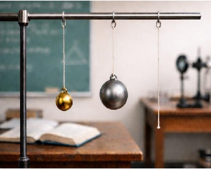

Further,

Pass the thread over a pulley. Attach a weight to one side and observe.

Now attach equal weights (equal bobs) on both sides of the pulley. Does the rope move, or does it only stretch?

Replace one of the equal bobs with a heavier bob on the left side. Observe carefully the direction in which the system moves.

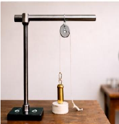

When both sides have equal weights, the system remains

- at rest because the forces are balanced. When one side is heavier, the system moves toward the heavier side. Tension

Tension is the pulling force/ stretch force that travels through a stretched string, thread, rope, or cable. When you hang an object using a thread, the object pulls the thread downward because of its weight. In response, the thread pulls the object upward. This pulling force inside the thread is called tension. If the weight attached to the string increases, the tension in the string also increases.

It always acts along the length of the string and pulls away from the object to which it is attached.

S.I unit of tension is Newton.

When the forces acting on an object are balanced (for example, the upward tension is equal to the downward weight), the object remains at rest or moves with constant speed. This state is called equilibrium. In a pulley system, if equal

weights are placed on both sides, the tensions balance and the system does not move. But if one side is heavier, the forces become unbalanced, and the system moves toward the heavier side. This is by Newton’s First Law of Motion.

Let us Calculate: Tension and acceleration are produced when two unequal masses are connected over a pulley.

- 1. Do the setup of weights, string and simple pulley as shown.

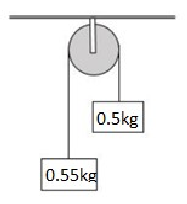

- 2. Since 0.55 kg > 0.5 kg, the 0.55 kg mass will move downward. The 0.5 kg mass will move upward. Both masses will move with the same acceleration because they are connected by the same string.
- 3. For 0.55 kg mass (moving downward): a. Downward force = Weight = ___________ b. Upward force = Tension (T)
- 4. Net force: 0.55𝑔 − 𝑇 = 0.55𝑎
- 5. For 0.5 kg mass (moving upward): a. Downward force = Weight = ___________ b. Upward force = Tension (T)
- 6. Net force: 𝑇 − 0.5𝑔 = 0.5𝑎
- 7. Add both equations: ________________________________
- 8. Acceleration of the system: ________________
- 9. Find Tension: __________________

Examples:

- 1. A 5kg object is suspended stationary from a rope. Calculate the tension. Ans: The weight of the object is: 𝑇 = 𝑚 × 𝑔 = 5 × 9.8 = 49 𝑁
- 2. A 4 kg mass is lifted upward with an acceleration of 2 m/s². Calculate the tension. Ans: Using Newton’s Second Law

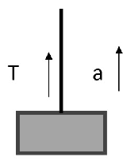

𝑇 − 𝑚𝑔 = 𝑚𝑎𝑇 = 𝑚(𝑔 + 𝑎)𝑇 = 4(9.8 + 2)𝑇 = 47.2 𝑁

Check Your Understanding :

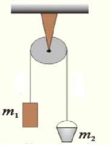

- 1. Show the direction of weight and tension for both objects m1 and m2.
- 2. An 8 kg mass hangs freely from a single fixed pulley. The system is at rest. Find the tension in the rope.
- 3. Observe the given diagram. Find out in which direction the rope will move? What will be the net downward force?
- 4. A 6 kg mass hangs freely from a single fixed pulley. The system is at rest. Find the tension in the rope.
- 5. Two objects having masses 2 kg and 6 kg are connected over a frictionless pulley with the help of rope. Find acceleration and tension in the rope.

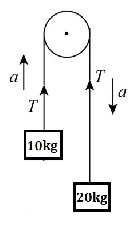

*************************************************************************************************

|Work and Energy|
|---|

- 5.1 CONSERVATIVE AND NON-CONSERVATIVE FORCES Recollect these common occurrences:

- ● A ball thrown upward comes back down to your hand.
- ● A stretched rubber band returns to its original shape.
- ● A sliding book on a table finally stops. Now think carefully:
- ● Why does the ball come back?
- ● Why does the rubber band regain its shape?
- ● Why does the book stop moving?

In all these cases, forces are acting. But are all these forces the same? Conservative Forces

- ● If the work done by the force doesn’t depend on the path.
- ● Work done by the force on the closed path is always zero.
- ● For a conservative force, the work done by the force equals the decrease in potential energy: W = –ΔU = –(U_final – U_initial) = U_initial – U_final. Equivalently, ΔU = U_final – U_initial = –W.

Examples: Gravitational force (Earth pulling objects downward) and Spring force (stretched or compressed spring)

Non-Conservative Forces: If the work done by the force depends on the path taken.

Examples: Friction (solid and drag)

When you slide a book across a table, it eventually stops because friction converts its kinetic energy into heat. This lost energy cannot be fully recovered.

That is why friction is a non-conservative force. Reflect on the following:

- ● If there were no friction, would a moving object ever stop?
- ● Why do pendulums slowly stop after some time?
- ● Why do machines require lubrication?

Quick Check

- 1. Define a conservative force with one example.
- 2. Why is gravitational force called a conservative force?
- 3. Why is friction called a non-conservative force?
- 4. What happens to energy when a non-conservative force acts on an object?
- 5. If there were no friction on Earth, how would motion be different? Explain.

##### 5.2 Potential Energy of a SpringActivity 5.2:

Collect the following items: A spring, a stand, a weight hanger, slotted weights, a ruler.

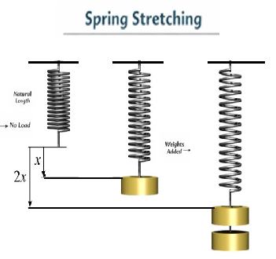

- 1. Suspend a spring vertically from a rigid support.
- 2. Attach a weight hanger to the free end of the spring and note the initial length of the spring.
- 3. Add a known weight to the hanger and measure the extension produced in the spring.
- 4. Increase the weight gradually and note the corresponding extension each time.
- 5. Repeat the experiment using springs made of different materials or thickness.

Observation:

● As more weight is added, the extension of the spring increases. Different springs show different extensions for the same applied weight. Conclusion: The extension of a spring is directly proportional to the applied force (weight), provided the elastic limit is not exceeded. This relationship can be expressed as:

𝐹 = 𝑘𝑥

where 𝐹= applied force, 𝑥= extension produced, 𝑘= spring constant, which depends on the nature of the spring.

This law is called Hooke’s law and is mathematically stated as F=−kx. The negative sign indicates the force is a restoring force acting against the direction of displacement (elongation or compression), aiming to return the spring to its original length.

Its unit is N m-1. The spring is said to be stiff if k is large and soft if k is small. Derivation

● The spring obeys Hooke’s Law

𝐹 ∝ 𝑥 𝐹 = 𝑘𝑥 Prepare a graph between Force and extension in the spring with the help of data observed in the activity by taking

- ● X-axis → Extension (m or cm)
- ● Y-axis → Force (N) Observation Table These values give a straight-line graph passing through origin. Sample Values for k= 100 N/m

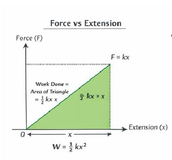

|Force (F) in N|Extension (x) (in cm)|Extension (x) (in m)|
|---|---|---|
|0|0 cm|0 m|
|20|20 cm|0.2 m|
|40|40 cm|0.40 m|
|60|60 cm|0.60 m|
|80|80 cm|0.80 m|
|100|100 cm|1 m|

Calculation of Average Force: For a spring stretched from 0 to maximum force:

𝐹 + 𝐹

𝐴𝑣𝑒𝑟𝑎𝑔𝑒 𝐹𝑜𝑟𝑐𝑒 =

2 When the spring is stretched gradually from zero extension to a maximum extension 𝑥, the force acting on it does not remain constant.

- ● At the beginning, force = 0
- ● At extension 𝑥, force = 𝑘𝑥 So, the average force (spring force changes linearly from 0 to maximum as extension increases.) acting on the spring is given by:

0 + 𝑘𝑥 2

𝑘𝑥 2

𝐹 =

=

Work done in stretching the spring = Average force × Extension 𝑊 =

𝑘𝑥 2

1 2

× 𝑥 =

𝑘𝑥

Conclusion The work done in stretching the spring is stored in it as elastic potential energy.

1 2

𝑈 =

𝑘𝑥

Example: A spring obeys Hooke’s law with a spring constant of 30 N m⁻¹. If a force of 100 N is applied to the spring, calculate the extension produced in the spring. The Force-extension graph of a spring of spring constant 100 N m⁻¹ is given in figure:

- (a) Using the graph, determine the work done in stretching the spring from 2 cm to 6 cm.
- (b) If the spring is released from the stretched position of 6 cm, calculate the maximum speed of a body of mass 0.5 kg attached to the spring, assuming no loss of energy.

- 0
- 1
- 2
- 3
- 4
- 5
- 6
- 7
- 8
- 9
- 10
- 11

| | | | | | | | | | |
|---|---|---|---|---|---|---|---|---|---|
| | | | | | | | | | |
| | | | | | | | | | |
| | | | | | | | | | |
| | | | | | | | | | |
| | | | | | | | | | |
| | | | | | | | | | |
| | | | | | | | | | |
| | | | | | | | | | |
| | | | | | | | | | |
| | | | | | | | | | |

Force (N)

0 0.020.04 0.06 0.08 0.1 0.12 0.14 0.160.18 0.2

Extension (m)

Solution:

- (a) Work done = area under force–extension graph

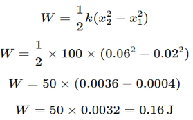

- (b) k = 100 N/m, x = 0.06 m. Elastic PE = ½ × 100 × 0.06² = 0.18 J. At maximum speed, all PE converts to KE: 0.18 = ½ × 0.5 × v², so v² = 0.72, v ≈ 0.85 m/s.

Check Your Understanding

- 1) Explain the conversion of potential energy to kinetic energy when a ball is thrown upward.
- 2) Why is gravitational potential energy considered a conservative force?
- 3) Calculate the potential energy of a 5 kg object kept on the top of a 30m high building. (Considering potential energy to be zero at the base of the building.)
- 4) What is the increment in its potential energy?
- 5) A 10 kg weight is hung from a 5 m wire, causing it to stretch by 1 mm. Calculate the energy stored.
- 6) Calculate the work done by an external force to lift a 2 m long rod from a horizontal to a vertical position.

***********************************************************************************************

|Structure Of Atom|
|---|

##### 6.1 Discovery of Subatomic Particles

You have learnt about the development of models of the structure of the atom. You would recall that in 1803, Dalton proposed that atoms are the smallest indivisible particles of matter. However, this idea could not explain the results of several experiments. For example, it was observed that substances like glass or ebonite, when rubbed with silk or fur, acquire electric charge. This and many other experiments on electrical discharge through gases showed that atoms are not indivisible. They are made up of smaller particles called subatomic particles.

J. J. Thomson, in 1897, discovered the electron as a constituent of the atom and confirmed that the atom is not the smallest particle of matter. He proposed the socalled plum-pudding model of the atom, in which electrons are embedded in a sphere of positive charge. This model was later shown to be incorrect by Rutherford, as it could not explain the results of the gold foil experiment. Rutherford then proposed a model in which electrons revolve around a small, positively charged nucleus. However, this model could not explain the stability of the atom. Thereafter, another model was proposed by Niels Bohr.

Here, you will learn about the discovery of the subatomic particles—electron, proton, and neutron—which contribute to our understanding of atomic structure. Before discussing these exploration we must recall a basic principle: like charges repel each other, while unlike charges attract each other.

###### 6.1.1 Discovery of Electron

In the late nineteenth century, many scientists, including Michael Faraday, William Crookes, and others, studied electrical discharge in partially evacuated tubes known as cathode ray discharge tubes. J.J Thomson carried out experiments by taking gases at low pressure in discharge tube which is a long glass tube in which two metal plates connected to oppositely charged poles of battery (Fig 1)

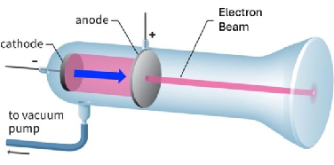

Fig. 6.1: A schematic representation of cathode ray tube showing the cathode rays going from the cathode to anode in a straight line

When a sufficiently high voltage is applied across the electrodes, rays are observed to travel from the negatively charged electrode (cathode) towards the positively charged electrode (anode). (Fig 2)

These are called cathode rays. The presence of these rays can be detected by allowing them to pass through a hole in the anode and strike at screen coated with a special material placed behind it. A bright spot is observed on the screen, indicating that the rays travel in straight lines.

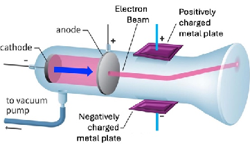

- Fig.6.2: A schematic representation of the deflection of cathode rays to positive plate of the applied electric field.

Further to determine the nature of these rays, Thomson carried out experiments by applying electric and magnetic fields in the path of the rays. He observed that the rays were deflected towards the positively charged plate.

This showed that the particles in the rays carry negative charge on further experimentation. Thomson concluded that cathode rays consist of tiny negatively charged particles, later called electrons.

When these experiments were repeated using different gases (such as hydrogen, nitrogen, neon, etc.) and different electrode materials, it was found that the properties of cathode rays remained unchanged. This showed that electrons are present in all atoms.

The main characteristics of cathode rays are as follows:

-  They originate from the cathode and move towards the anode.
-  They are not visible themselves but produce bright spot when they strike certain materials.
-  They travel in straight lines in the absence of external fields.
-  They are deflected by electric and magnetic fields in such a way that indicates them to be negatively charged.
-  Their properties do not depend on the nature of the gas or the electrode material.

Thus, electrons are a fundamental constituent of all atoms.

###### 6.1.2 Discovery of Protons

After the discovery of the electron, it was realised that since electrons are negatively charged, atoms must also contain positive charge to maintain electrical neutrality.

Eugen Goldstein, in 1886, performed experiments using a discharge tube similar to that used for cathode rays, but with a cathode having holes in it (perforated cathode). When high voltage was applied, a faint glow was observed behind the cathode. The rays responsible for this glow passed through the holes (or canals) in the cathode and were therefore called canal rays.

Further studies showed that these rays were deflected towards the negatively charged plate in electric and magnetic fields, indicating that they consist of positively charged particles.

However, it is important to note that canal rays are not made up of a single type of particle. They consist of positively charged ions of the gas present in the tube. Therefore, their properties depend on the nature of the gas used.

When hydrogen gas was used in the discharge tube, the positively charged particles obtained were the lightest known and were identified as hydrogen ions (H⁺). These particles were later recognised as protons. The proton was finally established as a fundamental particle by Rutherford in 1919.

The main characteristics of canal rays are:

-  They are positively charged.
-  Their behaviour in electric and magnetic fields is opposite to that of electrons.
-  Their properties depend on the nature of the gas present.
-  The lightest positive particle was obtained from hydrogen and is called the proton.

###### 6.1.3 Discovery of Neutrons

Once electrons and protons were known, it appeared that the structure of the atom was understood. However, another problem arose when atomic masses were measured. The mass of atoms was found to be greater than the sum of the masses of their protons and electrons. For example, helium contains two protons, yet its mass is about four times that of hydrogen. This indicated the possibility of the presence of another particle contributing to the mass of the atom.

It was proposed that there must be a neutral particle present in the atom. This particle was discovered by James Chadwick in 1932. He bombarded a thin sheet of beryllium with alpha particles and observed the emission of powerful neutral

radiation. This radiation consisted of particles having no charge and a mass nearly equal to that of the proton. These particles were called neutrons.

Neutrons are present in the nuclei of almost all atoms. The most common isotope of hydrogen that does not contain a neutron is protium (1H1) but its heavier isotopes Deuterium (1H2) and Tritium (1H3) contains neutrons.

Thus, the presence of neutrons explains the mass of atoms. For example, helium contains two protons and two neutrons, which accounts for its mass being approximately four times that of hydrogen.

Chadwick was awarded the Nobel Prize in Physics in 1935 for the discovery of the Subatomic particle neutron.

From these discoveries, it became clear that atoms are composed of three subatomic particles:

 Electrons (negative charge)  Protons (positive charge)  Neutrons (no charge)

These particles together determine the structure and properties of atoms. Quick Check:

- 1. Why do cathode rays bend towards the positive plate?
- 2. What conclusion did Thomson draw from using different gases in discharge tubes?
- 3. Why are canal rays different from cathode rays in nature?
- 4. Why was the discovery of neutron necessary?
- 5. In a cathode ray experiment, it was observed that the rays bend towards a positively charged plate. What can we conclude about the nature of these rays?
- 6. In a discharge tube experiment, the gas is changed from hydrogen to neon, but the behaviour of cathode rays remains unchanged. What does this observation tell us about electrons?
- 7. If cathode rays were neutral instead of being negatively charged, how would their behaviour differ in an electric field?
- 8. In an experiment with canal rays, different gases are used and different masses of particles are observed. What conclusion can be drawn about the nature of canal rays?

- 9. Why did scientists feel the need to propose the existence of neutral particles even after discovering electrons and protons? Explain using the example of helium.
- 10. In Chadwick’s experiment, the emitted particles were not deflected by electric or magnetic fields. What does this observation indicate about the nature of these particles?

##### 6.2. Spectrum

When white light passes through a glass prism, what do we observe? We see a rainbow, that consists of a continuous spread of many colours from violet to red (VIBGYOR). Such a spread is called a continuous spectrum in which the colours are present without any gap.

Fig 6.3 Continuous Spectrum

Now, suppose we take a sodium vapour lamp, which you would have seen at street lights or in parks, and pass the ‘yellow light’ given out by it, through a prism. We find that we do not get all the colours but only a few bright coloured lines. Two of these are intense yellow lines. We may do a similar experiment with mercury vapour lamp and observe another set of distinct lines. Such a spectrum that contains distinct lines is called a line spectrum.

Fig 6.4 (a) Sodium vapour lamp Fig 6.4 (b) Lines Spectrum of Sodium

Line spectrum means only specific radiation are emitted, not all. It is important to know that the line spectrum is characteristic of the element causing it. This fact is used to identify elements present in stars by studying their spectra. Even without going to the star, we can know what it is made of.

- 6.3 Line Spectrum of Hydrogen Now, when the radiation from a discharge tube containing hydrogen gas in it is passed through a prism, it also gives line spectrum called hydrogen atom spectrum. The Spectral lines for atomic hydrogen are:

|Series|ni|nf|
|---|---|---|
|Lyman|1|2,3_ _ _ _ _|
|Balmer|2|3,4_ _ _ _ _|
|Paschen|3|4,5_ _ _ _ _|
|Brackett|4|5,6_ _ _ _ _|
|Pfund|5|6,7_ _ _ _ _|

The energies of the distinct spectral lines observed in hydrogen atom spectrum could be expressed empirically in terms of mathematical expressions involving two sets of integers. This equation is known as Rydberg Equation.

RE =109,677 cm-1

Where, RE is the Rydberg constant expressed in terms of energy and Z is the atomic number. These empirical formulas worked very well but could not be explained until Bohr’s model came.

- 6.4 Limitation of Rutheford Model of Atom

-  Rutherford could not explain stability as the electron continuously loses energy when it moves around the nucleus.
-  As the electron in the atom is allowed to have continuous energies, therefore the emitted radiation is expected to give a continuous set of radiation. However, we observe a line spectrum. Therefore, we say that Rutherford’s model fails to explain the existence of line spectrum of hydrogen.

- 6.5 Bohr’s model

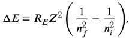

Neils Bohr, a student of Rutherford, in 1913 proposed his model for an atom. He combined Rutherford’s nuclear model with the new quantum idea introduced by Max Planck. He made two revolutionary assumptions which are as below:

-  Electrons can move only in certain allowed circular orbits without radiating energy. That is, they have a fixed energy as long as they are in a given orbit.
-  The radiation is emitted or absorbed only when an electron jumps from one allowed orbit to another,

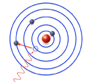

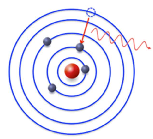

Fig 6.5:Energy change is electron jump

- 6.5.1 Achivement of Bohr Model

“When an electron jumps from an orbit of higher energy to that of a lower energy it releases energy in the form of radiation. The amount of energy released depends on the difference in the energies of the two levels. Since the orbits of only certain energies exist, only of fixed quantity energy differences are possible. Therefore, we get a line spectrum. Bohr’s model could explain the observed line spectrum of hydrogen fairly well.

- 6.5.2 Limitations of Bohr’s model Bohr model was unable to explain:

-  Finer details (that is closely spaced lines) of hydrogen atom spectrum observed by sophisticated spectroscopic techniques.
-  The spectrum of atom other than hydrogen.
-  The splitting of spectral lines in presence of magnetic field (Zeeman effect) or an electric field (Stark’s effect).

###### 6.6 Check Your Understanding

- 1. The hydrogen spectrum consists of only a few sharp spectral lines instead of a continuous spectrum. What information does it provide about the energy of electrons in an atom.
- 2. Explain why would Rutherford’s model predict a continuous spectrum rather than a line spectrum.
- 3. A discharge tube filled with an unknown gas produces a line spectrum identical to hydrogen. What can you conclude about the gas? Give reason.
- 4. If electrons in an atom were allowed to have a continuous set of energy values, what kind of spectrum would you expect? Why is this not observed?
- 5. “Bohr’s model solved all problems of atomic structure.” Comment.
- 6. How does the concept of fixed energy levels explain the stability of atoms?

- 7. Why do different elements produce different line spectra? Give a conceptual explanation.
- 8. Explain why Bohr’s model works well for hydrogen but not for multi-electron atoms.
- 9. State two limitations of Rutherford’s model.
- 10. Rutherford’s model explained the structure of the atom but failed to explain atomic stability and spectra. Discuss.
- 11. What was the main drawback of Rutherford’s model regarding electron motion? What assumption was made by Bohr to overcome this problem.
- 12. How does Bohr’s model explain line spectrum of hydrogen?
- 13. Outline the limitations of Bohr’s model.
- 14. Define line spectrum and continuous spectrum with one example each.
- 15. Write two main postulates of Bohr’s model.
- 16. What is meant by fine structure in hydrogen spectrum?
- 17. What is the significance of Rydberg equation?

|Chemical Bonding|
|---|

##### 7.1 Octet Rule

You have learnt that the atoms having eight electrons in its valence shell are stable. The atoms other than hydrogen tends to form bonds until it is surrounded by eight valence electrons. They do so by gaining, losing or sharing electrons. It is called Octet rule and is quite useful in describing the formation of simple molecules. It is important to note that the octet rule is just a guiding principle and not a law. In case of hydrogen, the valence shell attains the electron configuration of helium, i.e., a total of two electrons.

- 7.1.1 Lewis Approach

Lewis Symbol :- The Valance electron of an atom in terms of dot is written around the atom. For Example: Fluorine (F=9) Electronic configuration=2,7 Valence electron=7 Hence is represented as:

Bonding in molecule: Duing bonding the valance electrons are written around the atoms and then electrons are shared in such a way so as to complete the octet of each atom. For Example the Lewis formula for Hydrogen Fluoride is

or

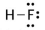

Here the pair of dots (representing electrons) placed between the symbols of the combining atoms represent the bonding electrons. The remaining dots represent the non-bonding electrons. As the name suggests, the non-bonding electrons do not contribute to the bonding. You may note that the hydrogen atom in this molecule has only two electrons (a duplet) around it. The line here indicates the bond between hydrogen and fluorine atom.

- 7.1.2 Exceptions of Octet Rule

Many stable molecules do not follow the octet rule. These are called exceptions to the octet rule. Let us discuss about these exceptions.

Molecules with incomplete octets

In case of some elements the valence shell has less than four valence electrons. In these cases, their atoms cannot form four bonds to complete the octet. Also, these do not have sufficient lone pairs that can complete the octet. As a result, the octet remains incomplete in such cases. For example, in case of lithium, beryllium and boron there are only 1, 2 and 3 valence electrons respectively. Therefore, these can form 1, 2 and 3 bonds respectively. In such cases the central atom would have 2, 4 and 6 electrons respectively on forming the molecule. These represent molecules which do not complete the octet and yet are stable. One common example is that of boron trifluoride. In this molecule, one boron atom makes bonds with three fluorine atoms and is represented as

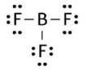

The lines here indicate the bond between boron and fluorine atom. Molecules with expanded octets

Another exception to the octet rule is observed in the formation of molecules having more than eight valence electrons around central atom. Such molecules are formed by the atoms of the elements having more than four electrons in their valence shell. For example, in case of sulfur hexafluoride one atom of sulphur combines with six atoms of fluorine. The Central sulphur atom has 12 electrons in its valence shell representing an expanded octet. We can represent its structure as

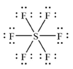

You will learn about the formation of such compounds in higher classes. Molecules with odd number of electrons

Certain molecules have an odd number of electrons. For example, an atom of nitrogen (having 5 valence electrons) makes two bonds with an atom of oxygen (having six valence electrons) to form a molecule of NO. It has a total of 11 valence electrons, five from N and six from O atom. The Lewis structure for this molecule can be represented as

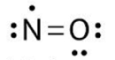

The two lines here indicate two bonds. Whenever there are odd number of electrons in a molecule then at least one atom would have an incomplete octet. Secondly in such a molecule there would always be an unpaired electron.

Quick Check

- 1. What is meant by the octet rule?
- 2. Why does hydrogen not follow the octet rule?
- 3. Give one example each of the molecule with a) incomplete octet b) expanded octet c) an odd electron
- 4. Why can boron form compounds with only six electrons around it?
- 5. What is meant by a duplet configuration?
- 6. Why is NO considered an exception to the octet rule?
- 7. Draw the Lewis dot structure of BF₃ and explain why boron does not complete its octet.
- 8. Assertion: SF₆ violates the octet rule. Reason: Sulphur can accommodate more than eight electrons.

- A. Assertion and reason, both are correct and reason is the correct explanation of the assertion.
- B. Assertion and reason, both are correct but reason is not the correct explanation of the assertion.
- C. Assertion is correct but reason is a wrong statement.
- D. Assertion is wrong but the reason is a correct statement.

##### 7.2 Metallic Bonding

You all are familiar with metals like iron, copper, aluminium, and so on. They are hard, they can be beaten into sheets, drawn into wires, and they conduct electricity. You may be wondering how can we explain these properties of metals. We can explain these in terms of a simple model known as the electron sea model for metals. You have learnt about bonding in case of ionic and covalent compounds. In these, the atoms bind by transfer or sharing of electrons between specific atoms. The electron sea model, in fact, is a simple model for bonding in metals. It involves bonding between a very large number of atoms of the metal. Let us understand this model and learn how we can explain the properties of metals by using this model.

- 7.2.1 Electron Sea Model

A metal atom has a few electrons in its outermost shell. These outer electrons are not held very tightly by the nucleus. Because of this, when many metal atoms come together to form a solid, these outer electrons do not remain attached to any

one atom. Instead, they become delocalised and are free to move throughout the entire piece of metal.

You know that when an atom loses an electron it becomes a cation. In metals, the atoms can be thought of as forming positive metal ions arranged in a regular pattern. These ions form a kind of fixed structure. The free electrons move continuously and randomly in all directions around and between these ions. This collection of freely moving electrons is called a “sea of electrons”.

Thus, according to the electron sea model, a metal can be seen as a structure in which positive metal ions are fixed in place, and a “sea” of mobile electrons moves around them. This is why the model is called the electron sea model as shown in

- Fig.7.1.

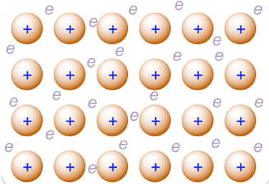

Fig. 7.1: Schematic representation of Electron sea model

These ions and electrons together form a stable structure. The attraction between the positive ions and the sea of electrons is what holds the metal together. This attraction is called metallic bonding. So, we can say that metallic bonding is the force of attraction between positive metal ions and the sea of electrons. It is important to note that unlike covalent bonds, metallic bonds are not localised. The electrons are shared by all the atoms collectively, forming a non-directional bond that can adjust to shifting positions of the metal ions.

- 7.2.1: Electron sea model and properties of metal Now let us see how this simple electron sea model helps us to understand the properties of metals.

Electrical conductivity

Since electrons are free to move, when we apply an electric field across a metal, these electrons start moving in a particular direction. This movement of electrons is what we call electric current. That is why metals are good conductors of electricity.

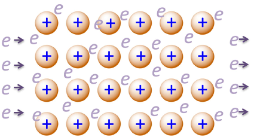

Fig.7.2: Schematic representation of electrical conduction by metals in terms of electron sea model

Thermal conductivity

When one part of a metal is heated, the electrons in that region gain energy and start moving faster. As they move, they transfer this energy to other parts of the metal. At the same time, the metal ions also vibrate more and help in passing the heat along. In this way, heat spreads quickly. This is why metals are good conductors of heat.

Malleability and Ductility

You know that malleability refers to the ability of metals to be beaten into thin sheets. In the electron sea model, the positive metal ions can slide over one another without breaking the structure. This is possible because the electrons are not fixed; they continue to move and hold the ions together. So, even when layers of the metal ions shift, the metal does not break.

Similarly, you know that ductility refers to the ability of metals to be drawn into wires. When we stretch a metal, these metal ions slide past each other without breaking the non-directional metallic bonds, allowing the metal to stretch into wires. The free electrons help maintain the attraction between ions even when the shape changes.

You must remember that the electron sea model gives a simple picture and explains many basic properties of metals. The electrons are not completely lost as in ionic bonding; rather, they are shared collectively by all atoms in the metal. You will learn more detailed models of metallic bonding in your higher classes.

Check Your Understanding

- 1. What is meant by the term “electron sea” in metals?
- 2. What type of particles are in a fixed position in a metal according to the Electron sea model?
- 3. Define metallic bonding.
- 4. Why are metallic bonds called non-directional?

- 5. Name two properties of metals explained by the electron sea model.
- 6. Explain how the electron sea model accounts for electrical conductivity in metals.
- 7. How does the electron sea model explain thermal conductivity in metals?
- 8. Why can metals be beaten into thin sheets? Explain using the Electron sea model.
- 9. What is meant by ductility? How is it explained by the electron sea model?
- 10. How is metallic bonding different from covalent bonding?
- 11. Explain the structure of a metal according to the electron sea model.
- 12. If electrons in a metal were not free to move, which property would be most affected? Explain.
- 13. Explain why metals do not break when hammered but instead change shape.
- 14. Copper is used for electrical wiring, while rubber is not. Explain using the electron sea model.
- 15. Why are metals generally good conductors of heat as compared to nonmetals?

- 19. Assertion (A): Metals are good conductors of electricity. Reason (R): Metals contain free electrons that can move under an electric field.

- A. Assertion and reason, both are correct and reason is the correct explanation of the assertion.
- B. Assertion and reason, both are correct but reason is not the correct explanation of the assertion.
- C. Assertion is correct but reason is a wrong statement.
- D. Assertion is wrong but the reason is a correct statement.

- 20. Assertion (A): Metallic bonds are non-directional. Reason (R): Electrons in metals are localised between two atoms.

- A. Assertion and reason, both are correct and reason is the correct explanation of the assertion.
- B. Assertion and reason, both are correct but reason is not the correct explanation of the assertion.
- C. Assertion is correct but reason is a wrong statement.
- D. Assertion is wrong but the reason is a correct statement.

- 21. Assertion (A): Metals are malleable. Reason (R): Layers of metal ions can slide while electrons continue to hold them together.

- A. Assertion and reason, both are correct and reason is the correct explanation of the assertion.
- B. Assertion and reason, both are correct but reason is not the correct explanation of the assertion.
- C. Assertion is correct but reason is a wrong statement.
- D. Assertion is wrong but the reason is a correct statement.

************************************************************************************************

|Mixtures And Separation Of Mixtures|
|---|

##### 8.1 Chromatography

Chromatography was first developed by the Russian botanist Mikhail Tswett in 1906 while studying plant pigments. He used this technique to separate the different coloured constituents of chlorophyll. This method was named chromatography components of chlorophyll. The name chromatography comes from the Greek words chroma (colour) and graphein (to write). The technique is used to separate the mixtures into components, purification of compounds and also to test the purity of compounds.

Principle: The technique is based on the difference in the rates at which the components move through a stationary medium under the influence of moving phase.. Application: Today, chromatography is widely used in chemistry, biology, and medicine to identify and separate different substances in a mixture. Column Chromatography Modern method for the separation of mixtures into its components. The selective removal of the components may be due to adsorption or partition process.

When a mobile phase is allowed to move over a stationary phase, the components of the mixture move by varying distances over the stationary phase because of different adsorption tendencies. In this case the stationary phase can be held on a cylindrical column of solid . hence it is called column chromatography.

Principle: It is based on the fact that different compounds are adsorbed on an adsorbernt to different degrees

Procedure: In this technique, a long glass tube having a stop cock near the bottom, called a column is used. First a plug of cotton or glass wool is placed at the bottom of the column. Then it is filled with a solid material such as silica gel or alumina, which acts as the stationary phase (fixed in a place). The mixture to be separated is placed at the top of silica gel in the column, and then a little amount of glass wool is placed above the mixture. After this a suitable liquid solvent is poured from above and allowed to flow through the column under the influence of gravity. This is called an eluent or the mobile phase (which moves). The solvent coming out from the column is collected in different fractions. In this way, the components of the mixture get separated and are collected separately. Column chromatography is widely used in chemistry laboratories to purify compounds as well as to separate them from the mixtures.

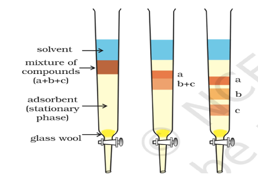

Fig 8.1: Column chromatography: Different stages of separation of components of a mixture.

Application: The method has been used:  To separate blue and red dyes  To separate and purify plant pigments

- 8.2.1 Fractional Distillation

This method is used for the purification of liquids which boil without decomposition and contain non volatile impurities.

Principle: Fractional Distillation is a technique to separate a mixture of two miscible liquids whose boiling points differ by less than 250C shown in Fig. 8.2 (a).

In this process, the mixture of liquids is heated in a distillation flask which is fitted with a fractionating column before the condenser as shown in figure 8.2(b).

Fractionating Column: The fractionating column is a long tube provided with obstructions to the passage of vapours moving upwards and liquid moving downwards. It increases the cooling surface area.

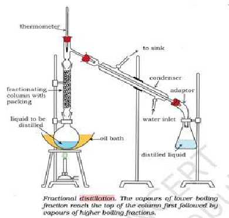

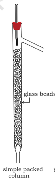

(a) (b)

Fig 8.2: (a) Fractional distillation apparatus and (b) A sample fractional distillation column

Procedure: When the mixture is added to distillation flask and the flask is heated the vapours of more volatile liquid having low boiling point rises up in the fractionating column.Due to the obstruction in the fractionating column,some of the vapours condense and fall back in the column.Some of the condensing liquid in the fractionating column gets heat from the ascending vapours and revaporizes. As a result the vapours become richer in low boiling component. These rise up in the fractionating column and condense while passing through condenser and collected in the receiver. The same process will occur again and again. This repeated condensation and vaporization helps in better separation of the liquids.By carefully controlling the temperature, different liquids in the mixture can be separated one after another according to their increasing boiling points.

- 8.2.2 How is it different from simple distillation?

-  In fractional distillation, a fractionating column is placed between the distillation flask and the condenser. The column provides many surfaces where repeated condensation and vaporization occur. This allows better separation of liquids whose boiling points are close to each other.
-  Simple Distillation is used to separate miscible liquid which differ in boiling point by at least 25oC but in fractional distillation the boiling point differ by less than 25oC

- 8.2.3 Application

Crude oil is a complex mixture of many hydrocarbons with different boiling points. In a refinery, the crude oil is heated, and the vapours enter a tall fractionating column. As the vapours rise in the column, they cool and condense at different levels according to their boiling points. Different fractions are collected at different heights of the column as shown in the figure below along with the temperature range. The various important fractions used in our daily life or industry are:

 Petroleum gas (LPG, contains butane and propane)

 Petrol (gasoline)

 Kerosene

 Diesel

 Fuel oils

 Lubricating oil and heavy oils

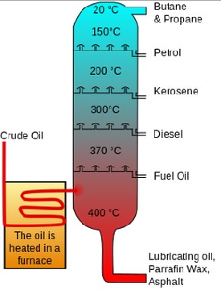

Fig 3: (a) Schematic representation of separation of different components of crude oil by fractional distillation

Questions

- 1. What is chromatography? Mention its two main phases.
- 2. Who discovered chromatography and in which year?
- 3. What is meant by stationary phase and mobile phase?
- 4. Name two common adsorbents used in column chromatography.
- 5. What is an eluent in column chromatography?
- 6. Why do different substances move at different speeds in column chromatography?
- 7. What is fractional distillation?
- 8. When is fractional distillation preferred over simple distillation?
- 9. What is the role of the fractionating column?
- 10. In column chromatography, a mixture of two compounds A and B is separated. A comes out first. What can you say about its interaction with the stationary phase?
- 11. A mixture of ethanol (b.p. 78°C) and water (b.p. 100°C) is to be separated. Which method will you use and why?
- 12. Explain why repeated condensation and vaporization improve separation in fractional distillation.
- 13. In a fractional distillation column, why does temperature decrease from bottom to top?
- 14. Why is simple distillation not suitable for separating liquids with close boiling points?
- 15. Assertion: In chromatography, separation occurs due to difference in boiling points. Reason: Components move at different speeds in the column.

- A. Assertion and reason, both are correct and reason is the correct explanation of the assertion.

- B. Assertion and reason, both are correct but reason is not the correct explanation of the assertion.
- C. Assertion is correct but reason is a wrong statement.
- D. Assertion is wrong but the reason is a correct statement.

- 16. Assertion: Fractional distillation gives better separation than simple distillation. Reason: It involves repeated condensation and vaporization.

- A. Assertion and reason, both are correct and reason is the correct explanation of the assertion.
- B. Assertion and reason, both are correct, but reason is not the correct explanation of the assertion.
- C. Assertion is correct, but reason is a wrong statement.
- D. Assertion is wrong, but the reason is a correct statement.

- 17. Difference in which property forms the basis for separating components in fractional distillation?

- A. Solubility
- B. Boiling points
- C. Particle size
- D. Chemical reactivity

- 18. What is the main purpose of the "fractionating column" in fractional distillation?

- A. To heat the mixture faster.
- B. To cool the vapours at fast rate.
- C. To provide more surface area for vapours.
- D. To let the vapours of two liquids mix properly

- 19. In column chromatography, the solid substance that is filled in the column is called the:

- A. Mobile phase
- B. Solvent
- C. Stationary phase
- D. Mixture

- 20. That component of a mixture moves down the column at a faster rate which is

- A. most attracted to the stationary phase.
- B. having the highest boiling point.
- C. The one most soluble in the mobile phase (solvent)
- D. The one with the largest particle

********************************************************************************

|Microscope and Microscopy|
|---|

##### 9.1. What is a Microscope?

You have read in Grade 8 that a special instrument called the microscope (micro – small; + skopion - "means of viewing") is required to observe tiny living organisms or their parts which cannot be seen through naked eyes by magnifying them. With a microscope, you can see small specimens such as onion cells, cheek cells, bacteria and even dust particles etc. It helps doctors to see germs and study cells in living organisms. What do we call the ability of a human eye to see two very close objects as separate and distinct? Imagine two tiny dots drawn on a piece of paper. As the dots are moved closer, there comes a point at which they can no longer appear as separate. When viewed from about 25 cm (the near point of the eye), two points separated by about 0.1 mm (100 µm) can be observed as distinct, otherwise, they appear as a single point. This defines the limit of resolution of the human eye. A cell is generally too tiny to be observed by an unaided eye. This raises an important question - how do cell biologists study the structure and functioning of cells, which are much smaller than the limit of resolution of the human eye? When Robert Hooke observed ‘cork’ under the microscope developed by him in 1665. He examined thin slices of bark of an oak tree and observed tiny hexagonal box-like spaces just like the patterns of honeycomb and called them cells. Around the same time, Antony van Leeuwenhoek made tiny, powerful lenses and saw “animalcules” – what we now know as bacteria and protozoa. Those simple lenses opened the door to a completely new world.

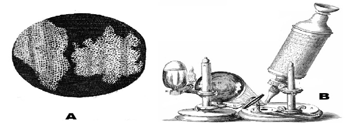

Figure 9.1: A. Drawings of Cork cells as published in the ‘Micrographia’; B. Microscope developed by Robert Hooke,

###### Activity 9.1: Let us think and write:If you could shrink yourself and travel inside a leaf, what would you see? Write 3 –

4 lines imagining that journey.

9.2. A Quick historical Journey of Microscopes

Let us walk through time and see how microscopes evolved:

-  13th–15th century: Simple magnifying glasses used by spectacle makers.
-  1590 - Hans and Zacharias Janssen: A Dutch father-and-son duo of spectacle makers developed an early compound microscope by combining two lenses within a single tube.
-  1665 – Robert Hooke: Coined the term ‘cell’ for empty, hexagonal, box-like structures by examining the cork of an oak tree under the microscope developed by him. He published his findings in a book called “Micrographia”.
-  1670s – Antony van Leeuwenhoek: He worked with a simple, single-lens microscope capable of magnifying up to about 300 times, which allowed him to observe tiny living organisms he called “animalcules,” including bacteria and protozoa. He was the first to study living microorganisms and is widely regarded as the Father of Microscopy.
-  1878 Ernst Abbe: Postulated a mathematical theory linking resolution to the wavelength.
-  19th–20th century: Better lenses and illumination improved the compound light microscope.
-  1930s onwards: Electron microscopes (TEM and SEM) were invented where viruses, cell organelles and cell surfaces could be observed.
-  1938 Ernst Ruska: developed the first electron microscope, which operated on the principle using electrons as the illumination source (instead of light) that provides shorter wavelengths and thereby significantly enhancing the resolving power.
-  1953: Frits Zernike received the Nobel Prize in Physics for inventing and demonstrating the phase-contrast microscope.

###### Activity 9.2: A Timeline StripDraw a horizontal line. Mark at least 5 important dates in microscopy and add atiny sketch or symbol for each (e.g., cork cells, bacteria, electron beam etc.).

- 9.3. How Does a Microscope Work? An important parameter in microscopy is the resolution, contrast and magnification of the object that is viewed under the lens, which makes it appear several times larger to the human eye. The operating principle varies with the type of microscope, which can be broadly classified by whether they use multiple lenses or electron beams. In each case, a system of lenses or electromagnetic fields is used to produce an enlarged, detailed image of a specimen that cannot be clearly seen with the naked eye. 9.3.1 Types of Light microscope

Light (Optical) microscopes rely on visible light and glass lenses to enlarge and view specimens.

Basic Classification -

-  A simple microscope utilizes a single lens to magnify an object, similar to how a magnifying glass works. For example, dissecting microscope is used for 3D viewing of small objects.
-  Compound Microscope: Most commonly used laboratory microscope utilizes at least two sets of lenses - the objective lens (near the specimen) and the eyepiece (ocular lens) - to achieve high magnification.
-  Advanced optical microscopes

Beyond the standard compound microscope, a diverse family of advanced light microscopes exists—such as Phase-Contrast and Fluorescence, each using unique optical technique to reveal hidden cellular secrets that would otherwise remain invisible to the naked eyes. Fluorescence microscopy uses high-intensity light to excite specialized dyes in a specimen, causing specific cellular structures to glow brilliantly against a dark background like stars in the night sky. PhaseContrast microscopy is used for viewing living cells in their natural state because it enhances contrast without the need for chemical stains that would otherwise kill the specimen.

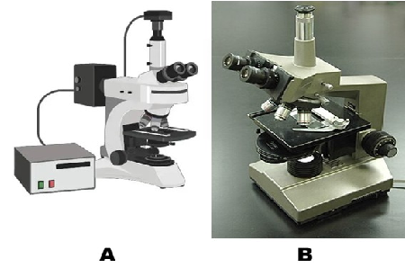

Figure 9.2: A. Fluorescence microscope; B. Phase contrast microscope

Figure 9.3: Cells imaged with – A. Traditional optical microscope (Mag. 40X) B. Phase-contrast microscope (Mag. 40X) and C. Fluorescence microscope (Mag. 20X)

- 9.3.2 Parts of a Compound microscope Core Components and their Roles

- 1. Light Source; Provides illumination (LED or halogen lamp).
- 2. Condenser Lens: Focuses light onto the specimen to optimize numerical aperture and contrast.
- 3. Specimen Stage: Holds the slide containing the specimen.
- 4. Objective Lens: The primary magnifying lens (e.g., 4X, 10X, 40X, 100X). It forms an enlarged, inverted image of the specimen that is real in nature.
- 5. Eyepiece (Ocular Lens): It enhances the magnification of the image already produced by the objective lens.

- Activity 9.3: Let us examine a compound microscope

Key parts include eyepiece, objectives, nosepiece, stage with clips, coarse/ fine focus, condenser, iris diaphragm, illuminator, arm, and base

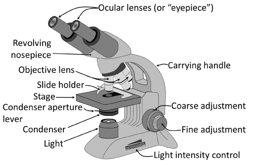

Figure 9.4: Light (compound) microscope

-  Objective lenses: Main magnifying lenses (with different magnification power (X) – 4, 10, 15, 20, 40 etc.) close to the slide. These form a real, magnified image of the object.

-  Eyepiece (ocular lens): Where you place your eye. It acts like a magnifying glass for the image formed by the objective. Together, these lenses produce a greatly enlarged image for your eye.
-  Body tube: A hollow tube which has the eye piece and objective fitted on its two ends.
-  Revolving nosepiece: Holds objectives and allows you to switch between them.
-  Stage and clips/ mechanical stage: Platform to hold the slide in place.
-  Condenser Lens: Consists of convex lens to focus and concentrate the light on specimen to optimize numerical aperture and contrast.
-  Substage diaphragm: Controls the amount of light transmitted on specimen
-  Coarse adjustment knob: Big knob for rough focusing (low power).
-  Fine adjustment knob: Small knob for sharp focus (high power).
-  Arm and base: Support; always hold microscope by the arm and support the base.
-  Light source/ mirror: Provides light that passes through specimen/reflects light.

- 9.3.3 Light Microscope – working

Light changes direction when it passes through glass. You have earlier learnt in Grade 8 that a convex lens (converging lens) bends light rays to meet at a point. When we place a tiny object near such a lens, the lens forms a larger, inverted image. Light microscopes function by using refraction—the bending of light as it moves between different media due to changes in speed—along with reflection to direct and focus light rays. The objective lens, which has a short focal length, first creates a real and inverted image of the specimen placed just outside its focal point. This image then becomes the input for the eyepiece, which has a longer focal length and further enlarges it, producing the final upright, highly magnified virtual image.

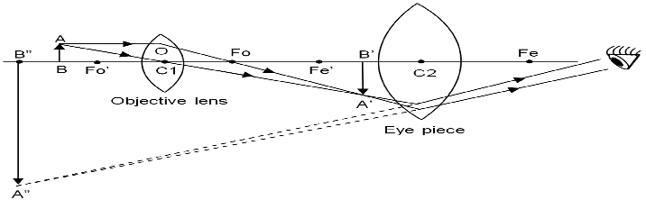

Figure 9.5: Ray diagram of compound microscope

##### 9.4. Microscopy Skills

- 9.4.1 Slide Preparation and Focusing (temporary mount) You have already learnt the method for preparing a temporary mount of an onion peel; using a similar approach, let us now create a few more temporary mounts.

Activity 9.4: Let us prepare, observe and compare leaf peels of monocot and dicot leaves:

Take peels from both upper and lower epidermis of a monocot leaf (Rhoeo/ maize/ lily) and a dicot leaf (Bryophyllum/ petunia/ balsam). Prepare their temporary mounts. Observe them under microscope, compare their structure and draw labelled diagrams. Record similarities and differences, if any.

Now corelate the points noted by you in activity 9.1 with your observations.

|S. No.  |Feature|Monocot leaf| |Dicot leaf| |
|---|---|---|---|---|---|
| | |Name of source plant………| |Name of source plant…...| |
|1.|Shape of epidermal cells| | | | |
|2.|Pattern of epidermal cells| | | | |
|3.|Shape of Guard cells| | | | |
|4.|Distribution of stomata| | | | |
|5.|Any other observation| | | | |

- 9.4.2 Permanent Slides

We have already learnt how to prepare temporary mounts. These are useful only for a short time because the drop of water slowly dries up and the living cells start shrinking, and dying.If you leave a temporary mount of an onion peel for a few hours, you will notice air bubbles, crystals of the dried stain, and distorted cell shapes instead of fresh, clear cells.

Now think, what if we want to keep a well prepared slide of onion cells or cheek cells safe so that many future batches of students in your school can observe it? For this purpose, biologists make permanent mounts. The slides stored carefully in slide boxes in your laboratory are usually permanent slides that have been prepared using a special technique and preserved for years.

In a permanent mount, the specimen is first fixed (to kill and preserve its structure), then stained, dehydrated, and finally sealed in a special mounting medium such as Canada balsam or DPX under a coverslip. This prevents the

specimen from drying, rotting, or being attacked by microorganisms. Once prepared properly, a permanent slide can be stored in the laboratory and used repeatedly without losing clarity of cells when seen under the microscope.

- Activity 9.5: Let us observe permanent slides of leaf peel of a monocot and dicot leaf

Observe a permanent slide of leaf peel of monocot and dicot leaf and compare it with the temporary mount prepared by you.

Do you find any difference in the clarity of the slides? Notice the cell walls and guard cells in the fresh temporary mount and the stained permanent mount of the dicot peel? Does the clarity of cell walls and guard cell differ? Identify two common anatomical differences in leaf peels that remain consistent in temporary and permanent mount.

- 9.4.3 By what factor is the image larger than the actual object?

When you look at a diagram of a cell or a tiny insect in your book, it often appears huge on the page, now you know that it might be smaller than a grain of sand. Further, when you observed onion peel cells under the microscope you would have noticed the difference in the size of image when we switch from low power to high power objective lens.

How do you know exactly how many times bigger you are seeing the image? We can find out by finding the magnification of objective and eye piece. Magnification is represented by the symbol X, which is read as “times,” for example, 10X means “magnified ten times.”

Magnification of a microscope: 𝑀 = 𝑚 × 𝑚 Where 𝑚 = magnification of objective, 𝑚 = magnification of eyepiece.

Example:

-  10X eyepiece and 40x objective → 𝑀 = 10 × 40 = 400.
-  Real size = image size / total magnification

Let us find out:

- 1. If a cell measures 5 mm on 100X image, calculate its actual size.
- 2. If you use a 15X eyepiece and 10X objective, what will be the total magnification?
- 3. If 4 cells fit across a 0.8 mm field of view, what will be the approximate size of one cell?

##### 9.5. Types of Microscopes

All microscopes do the same basic function – they magnify small objects – but they do it in different ways and to different depths. Magnification and resolution are core concepts in microscopy that define the imaging capabilities of a microscope. Different microscopes have different magnification powers and resolution ranges; the size of the specimen and purpose of observation determines which microscope can be used to view the specimen effectively.

- 9.5.1 Magnification vs. Resolution – Big vs. Sharp image Generally, students think: “More magnification is always better.” Not always true!

-  Magnification: Magnification is the factor by which a microscope enlarges the image of a specimen relative to its actual size (e.g., 400x).
-  Resolution: Resolution is the smallest distance between two very close points in a specimen to clearly distinguish them as separate and not merged into a single image. It is often expressed as a unit of length e.g. 0.2 μm for light microscopes. Higher resolution reveals fine details and gives a sharp image. Resolving power is the capacity of the microscope to clearly identify two very closely placed points as separate points. It is expressed as the reciprocal of resolution (smaller resolution means higher resolving power).

The resolution of human eye and some microscopes is given below: Instrument Resolution (in metre

Human eye ~ 1 × 10⁻⁴ m (≈ 0.1 mm) Light microscope ~ 2 × 10⁻⁷ m (≈ 0.2 μm) Electron microscope ~ 2 × 10⁻¹⁰ m (≈ 0.2 nm)

- 9.5.2 Light (Compound) Microscope This is the microscope you generally use in school laboratories.

-  It uses visible light and glass lenses.
-  Its magnification is usually up to about 1000x.
-  Its resolution (smallest detail you can see clearly) is about 0.2 μm.
-  It can be used to observe living cells, like moving protozoa or cheek cells.

- 9.5.3. Electron Microscopes

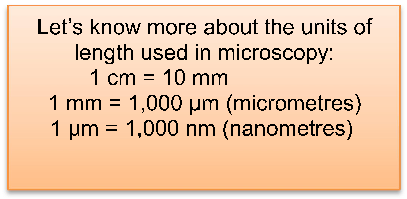

Let’s know more about the units of length used in microscopy:

1 cm = 10 mm 1 mm = 1,000 µm (micrometres) 1 µm = 1,000 nm (nanometres)

-  Electron microscopes operate with electron beams that have extremely short wavelengths (about 0.005 nm compared to 550 nm for visible light). These electrons are accelerated in a vacuum and directed using magnetic lenses.
-  Electrons also behave like waves, but with a much shorter wavelength than visible light. A shorter wavelength gives better resolution.
-  Electromagnets act as “lenses” to focus on the electron beam.
-  Source of electron beam (Tungsten filament).

- 9.5.3.1 Transmission Electron Microscope (TEM)

It is much more powerful as compared to the light microscope because it has better magnification and resolution.

-  It operates with a beam of electrons rather than light.
-  Extremely thin slices of the specimen, about 50–90 nm thick, are prepared using an ultramicrotome equipped with a glass knife.
-  Electrons pass through an ultra-thin slice of specimen.
-  Heavy metal stains like uranyl acetate (for proteins/ nucleic acids) and lead citrate (for lipids/ carbohydrates) are used. These increase electron density via positive staining, providing contrast without dissolving in embedding resins.
-  Internal details of cells – mitochondria, ribosomes, viruses etc. can be observed.
-  Image produced is two – dimensional (2D).
-  Resolution can be around 0.1 nm.

- 9.5.3.2 Scanning Electron Microscope (SEM)

-  It operates with a beam of electrons rather than light.
-  Unlike TEM's ultrathin sections (50-90 nm) cut by glass knives, SEM uses diamond knives for thicker sections or whole mounts.
-  Heavy metal coatings provide conductivity for electrons.
-  Electrons are reflected from the specimen.
-  Electrons scan the surface of the specimen.
-  Gives 3D-like images of surfaces – pollen grains, insect legs, microchips.
-  Resolution can be around 1 – 20 nm.

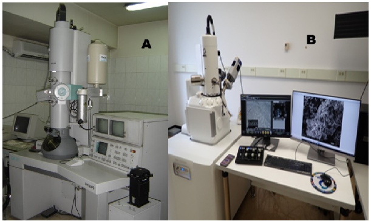

Figure 9.6: A. Transmission Electron Microscope B. Scanning Electron Microscope

(Source: Wikimedia commons)

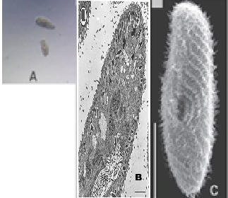

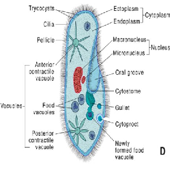

Figure 9.7: Paramecium as observed under - A. Light Microscope (Wikimedia commons); B. Transmission

electron microscope (Source: Research Gate); C. Scanning electron microscope (Source: Research Gate) and D. Diagrammatic representation.

###### 9.5.3.3 Let us compare Light microscope and Electron microscope (TEM andSEM)The comparison between these three types of microscopes can be summarised asbelow:

|S. No. Feature Light Microscope  Transmission Electron Microscope  Scanning Electron Microscope  | | | | |
|---|---|---|---|---|
|1.|Illumination source  |Visible light|Electron beam (broad)|Electron beam (focused, scanned)  |
|2.|Types of lenses|Glass (convex, achromatic)  |Electromagnetic coils (condenser, objective, projector)  |Electromagnetic coils (condenser, scanning, objective)  |
|3.|Thickness of section  |Up to several mm - whole mounts; 5 10 µm for tissue sections  |Ultra-thin (<100 nm, typically 50-90 nm ultramicrotomy)  |Surface only (no sectioning; samples 20 - 30 mm thick, coating 10 -100 nm)  |
|4.|Staining|Basic dyes (e.g., methylene blue, eosin; lightabsorbing)  |Dense metal compounds, such as uranyl acetate and lead citrate.  |Conductive coating (e.g., gold/ palladium; no traditional staining)  |
|5.|Observing living cells  |Yes (e.g., pond life, cheek cells)  |No (vacuum kills cells)|No (vacuum and the coating kills cells)  |
|6.|Resolution|~0.2 μm|~0.1 nm or better|~1-10 nm|
|7.|Magnification|Up to 1,500x|Up to 50 million x|Up to 2 million x|
|8.|Sample|Minutes|Hours-days|Hours (dehydration,|

| |preparation time|(simple mounting)  |(embedding, ultramicrotomy)  |coating)|
|---|---|---|---|---|
|9.|Cost|Low (~₹10,00050,000)  |Very high (₹50 lakh+)|High (₹20-50 lakh)|
|10.|Vacuum required  |No|Yes|Yes|

Think Why do you think electron microscopes are usually found in big research centres and not in normal school laboratories?

##### 9.6. What is new in Microscopy? What are the limits?

- 9.6.1 New Developments

With advances in science and technology, digital microscopes are being developed that show a real time image directly on a screen. Thus, live images can be shared with all students at once. In Super-resolution microscopes details smaller than the normal limits of light can be observed. Explore these latest inventions through books, trusted websites, science magazines, and virtual lab simulations, and find out what new things could we discover by using an even better microscope! Your curiosity today may help design the microscopes of tomorrow.

- 9.6.2 Limitations

-  With a light microscope, structures smaller than about 0.2 µm cannot be resolved due to the diffraction limit of light.
-  Electron microscopes are costly, need vacuum and very careful sample preparation; most samples have to be processed with chemicals and metal stains.

###### 9.7. Where do we use Microscopes?You might be surprised how often microscopes quietly support our lives.

-  Hospitals and Pathology laboratories: Diagnosing diseases by checking blood, sputum, tissue biopsies (e.g., malaria parasites in blood).
-  Science laboratories: Studying stomata, plant and animal tissues, plant diseases etc.
-  Industry: Checking quality of metals, plastics, electronic chips using light and electron microscopes.
-  Police and forensics: Examining fibres, hair, glass fragments, blood stains from crime scenes.
-  Environment: Checking water samples for algae, protozoa and pollution indicators.

Snapshots

-  Microscope (micro – small; + skopion - "means of viewing") is a special instrument required to observe tiny living organisms or their parts which cannot be seen through naked eyes.
-  Different microscopes have varied magnification powers and resolution ranges; the size of the specimen and purpose of observation determines which microscope can be used to view the specimen effectively.
-  Magnification is the factor by which a microscope enlarges a specimen's image relative to its actual size (e.g., 400 X).
-  Resolution is the smallest distance between two very close points in a specimen to clearly distinguish them as separate and not merged into a single image. It is often expressed as a unit of length e.g. 0.2 μm for light microscopes.
-  Light (Optical) microscopes rely on visible light and glass lenses to enlarge and view specimens.
-  Light microscopes function by using refraction—the bending of light as it moves between different media due to changes in speed—along with reflection to direct and focus light rays.
-  They can be broadly grouped according to the number of lenses used: simple microscopes have a single lens, while compound microscopes contain two or more lenses.

-  Fluorescence microscopy uses high-intensity light to excite specialized dyes in a specimen, causing specific cellular structures to glow brilliantly against a dark background like stars in the night sky.

-  Phase-contrast microscopy is a premier technique for observing living cells in their native state because it enhances contrast without requiring chemical stains that would compromise cell viability.
-  For light microscopy, we can prepare temporary or permanent mount depending upon the short term or long-term storage requirement.
-  Electron microscopes use electron beams (shorter wavelength ~0.005 nm vs. light 550 nm) accelerated in vacuum, focused by magnetic lenses.
-  Electron microscopes are classified as transmission (TEM) or scanning (SEM) based on how the electron beam interacts with the specimen—either passing through it or being reflected from its surface.
-  TEM shows internal details of cells in 2D – mitochondria, ribosomes, viruses etc while SEM gives 3D-like images of surfaces.
-  In addition to the study of cell and its organelles, microscopes are used for diagnosing diseases, for assessing the quality of metals, plastics, electronic chips, analysis of water samples and in forensics etc.

Check Your Understanding

- 1. A microscope has a 10X eyepiece and a 40X objective. a) What is its total magnification?

b) At this setting, the field of view is 0.4 mm. If 4 cells fit across, estimate the size of one cell.

- 2. a) You want to watch live protozoa moving in pond water. Which microscope (light, phase-contrast, TEM, SEM) is best and why?

b) Neha wants to study the 3D surface of a pollen grain. Which microscope should she choose and why?

- 3. Riya sees a sharp onion cell image at 100X, but when she switches to 400X, the image is big but very blurred. Name the concept causing this problem. Explain the reason.
- 4. Draw a ray diagram of a compound microscope.
- 5. Design a simple poster “How to take care of a microscope?” with three do’s and three don’ts.
- 6. At 40X total magnification, the field diameter is 4 mm. Predict the field diameter at 400X magnification (assume it is inversely proportional to magnification).
- 7. A student accidentally traps many air bubbles while placing the cover slip. How will this affect observation? Suggest two ways to avoid bubbles next time.
- 8. Compare TEM and SEM in terms of:  Type of image.  Best use (internal vs surface).
- 9. Plan a brief investigation using a school light microscope to compare the purity of three water samples (tap water, RO-purified water, and pond water). Outline the main steps and predict your expected observations.
- 10. Can we rely on electron microscopes for studying living cells? Explain the reason.
- 11. List two ways how microscopes are used in hospitals and one way they are used in industries that manufacture mobile phones.
- 12. Imagine you are Robert Hooke. Write a 5–6 lines diary entry about what you felt when you first saw “little boxes” (cells) in cork.
- 13. Ananya says, “If we add more and more lenses, we can see anything, even atoms, with a school microscope.” Use the idea of resolution to correct this statement.

###### 14. Nishant wants to observe the effect of concentrated salt solution on cells ofRhoeo leaf and also wants to keep slides for future reference. Answer thefollowing:

- a) Which type of mount should be used for this purpose? Give reason. b)
- b) Will the same slide be suitable for long-term storage? Elucidate the reason.

###### 15. Why is it important to fix and dehydrate cheek cells before mounting inCanada Balsam for school laboratory storage? Predict the consequences ifa student inadvertently skipped the fixation and dehydration steps beforemounting the specimen in Canada Balsam.

References:

- 1. Cell and Molecular Biology: P.K. Gupta
- 2. Laboratory Manual of Cell Biology: Rina Majumdar and Rama Sisodia
- 3. Microbiology – An introduction: Gerrard J. Tortora, Berdell R. Funke and Christine L. Case
- 4. https://ucmp.berkeley.edu/history/hooke.html#:~:text=Hooke%20had%20discovere d%20plant%20cells,the%20cells%20of%20a%20monastery.

- 5. https://www.microscope.com/education-center/microscopes-101/compoundmicroscope-parts

- 6. https://pmc.ncbi.nlm.nih.gov/articles/PMC6111892/

- 7. https://www.fizzicseducation.com.au/articles/digital-microscopy-teaching-studentsbiology-their-way/

- 8. https://www.microscope.com/education-center/articles/history-of-microscopes

- 9. https://bio.libretexts.org/Bookshelves/Microbiology/Microbiology_(Boundless)/03:_ Microscopy/3.01:_Looking_at_Microbes/3.1D:_Magnification_and_Resolution

- 10. https://www.jeolusa.com/RESOURCES/Electron-Optics/DocumentsDownloads/sample-preparation-techniques-conductive-coatings1

- 11. https://www.leica-microsystems.com/science-lab/life-science/brief-introduction-tocoating-technology-for-electron-microscopy/

- 12. https://www.ntnu.edu/documents/139994/141053151/TEM+sample+preparation.pd f/eb6c557f-8243-4923-9135-cc8f8fa5c37f

- 13. https://www.researchgate.net/figure/TFP-treatment-followed-by-Ca-2-ionophoreA23187-TFP-exposure-was-carried-out-at-the_fig5_16791858

- 14. https://www.researchgate.net/figure/Scanning-electron-micrographs-of-normal-aand-deciliated-b-paramecia-Note-that-the_fig5_15839897

|Engineering Life: Miracles in Biotechnology|
|---|

##### 10.1 Introduction to Biotechnology

For centuries, humans have relied on living organisms and their properties to improve the quality of life. Whether it is using bacteria to turn milk into curd, using yeast to make the bread we eat, or making the homemade probiotic drink, kanji. By influencing and modifying living organisms through innovation, humans have become engineers of life.

Figure 10.1: Miracles with Biotechnology

Biotechnology refers to the judicious use of living organisms, such as microbes, or their cellular components, to produce substances beneficial to humans. In the modern era, biotechnology has evolved from simple kitchen chemistry to sophisticated genetic engineering.

Human beings have been using biotechnology for a long time. Selective breeding and using the fermentation process for the production of cheese, beer and wine have been practiced since centuries. Today, microbes are not only used to make traditional fermented foods but are also widely exploited in industrial biotechnology for the production of valuable substances such as antibiotics, enzymes, improving the nutritional quality of food items, biofuels and the production of eco – friendly products.

As early as 1973, scientists observed that the genes from microbes can be taken out from one organism and can be inserted in different organism to get a desired altered gene. This branch of biotechnology is called genetic modification/ genetic engineering/ recombinant DNA (rDNA) technology, wherein the gene is modified to enhance the production of enzymes, antibiotics, vitamins, hormones (such as insulin), and other industrially significant substances. Thus, Biotechnology has led to advancements in many fields such as medicine, agriculture, animal science and environmental science.

Some common areas where Biotechnology has led to advancements are:

|Category|Areas covered|
|---|---|
|Blue Biotechnology|Application of biotechnology for marine and freshwater organisms, which are used for increasing the seafood supply, regulation of water – borne diseases and developing new drugs.|
|Green Biotechnology|Improvement in the nutritional quality, quantity and production of eco – friendly products. Development of transgenic plants for better productivity and disease resistance.|
|Red Biotechnology|Medical Biotechnology, which is applied to manufacture pharmaceutical products such as insulin, enzymes, antibiotics, and vaccines|

(Source: Biotechnology: textbook for class XI, NCERT Publication)

- Activity 10.1: Observe Fermentation at Home Aim: To understand microbial action in food. Materials Required: Warm milk, a spoon of curd, one bowl Procedure:

- 1. Pour warm milk into a bowl.
- 2. Add a spoonful of curd into it.
- 3. Leave it overnight in a warm place. Observation: Milk turns into curd. Conclusion: Microorganisms present in curd convert milk into curd.

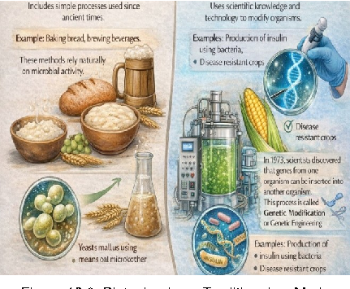

Discuss with your parents. In what times or situations does curd take a long time to form? What conditions support the curdling of milk?

Quick Check

- 1. What is biotechnology?
- 2. Give two examples from your daily life demonstrating the use of biotechnology.
- 3. Why are microorganisms important in biotechnology? Figure 10.2: Biotechnology: Traditional vs Modern

- 10.2 Traditional vs Modern Biotechnology Traditional biotechnology includes simple processes used since ancient times.

Example- Making wine, baking bread, brewing beverages. These methods rely on natural microbial activity.

Modern biotechnology uses scientific knowledge and technology to modify organisms. The process of transfer of genes from one organism to another involves a set of molecular techniques that allow scientists to deliberately modify the genetic material of an organism. Herein, specific genes can be “cut” from one organism and “inserted/ pasted” into another.

Examples: Production of insulin using bacteria, disease-resistant crops Let us research

- Activity 10.2: Traditional Biotechnology around you

-  Part A: Research on Fermented Foods: Make a list of fermented foods used in your home or community. Identify the microorganism that may be responsible for it?
-  Part B: Preparing Probiotic Kanji Prepare kanji, a traditional fermented drink using carrot and beetroot.

-  Place chopped carrot and beetroot pieces in a clean glass jar. Add water, salt, and a little mustard powder.
-  Keep the jar in sunlight for 2–3 days, stirring once daily.
-  Observe the changes in aroma, colour, and formation of bubbles, which indicate microbial activity during fermentation.

Observation: Record your observations and results in the following table.

Conclusion: ……………………………………………………………..

Quick Check

|Traditional Biotechnology|Modern Biotechnology|
|---|---|
|Uses natural microbial processes|Uses __________ techniques|
|Used since __________ times|Developed in __________ times|
|Example: Making curd and bread|Example: Production of __________ using bacteria|
|Has limited control over __________|Provides greater control over __________|
|Does not involve gene transfer|Involves __________ modification|

- 10.3 Microbes as Tools in Biotechnology Microorganisms such as bacteria, yeast and fungi are widely used in biotechnology. Why is the reason for this?

-  Microbes are easy to grow. Bacteria can double their population in 20 minutes.
-  They need basic nutrients (sugar, nitrogen) for their growth.
-  They do not need much space, as millions of bacteria can be grown in a small space.
-  Their DNA can easily be manipulated.
-  Their DNA is self-replicating.

Let us observe

Figure 10.3: (A) Bacteria (B) Fungus

- Activity 10.3: Fermentation at home Mix 2 teaspoons of sugar in a bowl of warm water and add 1 teaspoon of dry yeast.

Cover it and wait for 15 minutes. Observation: You will observe frothing and a pungent odour emerging. Discussion: The froth is CO2, and the smell is due to ethanol. The yeast is "working" by breaking down sugar.

- 10.4 Applications of Biotechnology in Daily Life

A casual survey of everyday products reveals that biotechnology plays a key role in many of them. These innovations span diverse fields, transforming how we produce food, medicine, and more.

The following are the key areas involving the use of biotechnology.

- 1. Crop production and agriculture
- 2. Medicine and Health Care
- 3. Food processing
- 4. Bio-Enzymes: Revolutionizing Household Cleaning
- 5. Environmental protection

Figure 7: Genetically modified plant e.g.: Bt cotton

- 10.4.1 Crop production and agriculture

Genetic engineering of crop plants has enhanced traits like stress tolerance, insect resistance, viral resistance, productivity and nutritional value.

A gene is a segment of DNA that codes for specific proteins. Biotechnology now enables us to manipulate genes of interest to create recombinant DNA, producing genetically modified plants resistant to insect pests—like Bt cotton and Bt corn. Let's explore these examples further.

- 10.4.1.1 Pest-resistant crops

Bt toxin, a protein from the soil bacterium Bacillus thuringiensis, exhibits insecticidal properties. It targets larvae of moths, butterflies, and cotton bollworms but remains harmless to humans. The gene encoding this toxin is transferred to cotton, corn, potato, and tomato plants, creating transgenic varieties. These plants express the Bt toxin, which functions as a natural insecticide, protecting them from insect pests.

These plants are engineered to be "selfprotecting" against pests.

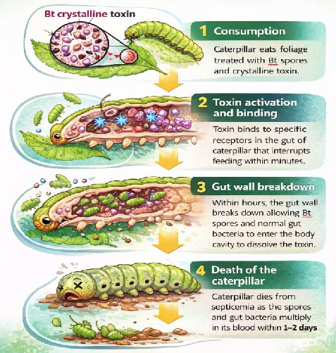

 Source: A soil bacterium called Bacillus thuringiensis (Bt) naturally produces a protein that is toxic for certain insects (like bollworms).

 Process: The "toxin gene" from this bacterium is identified, isolated and inserted into the DNA of cotton or corn plants.

 Result: The plant starts producing this protein in its leaves and stems. When a pest feeds on the plant, the toxin enters its gut and kills it. This reduces the need for harmful chemical pesticides.

Figure 8: Action of kurstaki (Bt) on Caterpillars

- 10.4.1.2 Improving nutritional quality

Biotechnology has improved the nutritional content of key food crops. A prominent example is Golden Rice, genetically modified to produce high levels of beta-carotene, a precursor to vitamin A.

Golden Rice

 This bio-fortified crop helps fight malnutrition, especially Vitamin A Deficiency (VAD), which causes blindness in millions of children.

 Problem: Normal rice is a great source of energy but lacks Vitamin A.

 Process: Scientists inserted genes from maize (corn) and a soil bacterium into the rice plant. These genes allow the rice to produce beta-carotene, a precursor to Vitamin A.

 Result: The rice grains turn a golden-yellow colour because they are packed with beta-carotene, which our bodies convert into Vitamin A. It acts as a "medicinal food" for people in regions where rice is the main diet.

- 10.4.2 Medicine and Health Care Making human insulin using bacteria is a brilliant piece of engineering. Instead of relying on animals, scientists "instruct" bacteria how to synthesize human insulin by giving them the right genetic instructions. Steps: DNA Isolation

Scientists have identified the specific human gene that contains the gene for making insulin. They use special biological "scissors" called restriction enzymes to cut this gene out of human DNA. This leaves "sticky ends" on the gene so it can attach to something else later.

Preparing the Plasmid

Bacteria have small, circular loops of DNA called plasmids (extracellular DNA). Scientists take a plasmid and cut it open using the same restriction enzymes used for the human gene. This ensures the plasmid has matching "sticky ends" that fit the human insulin gene perfectly.

Combining the DNA (Ligation)

The human insulin gene is mixed with the cut bacterial plasmid. An enzyme called DNA ligase acts like biological glue, joining the two pieces together. This creates a recombinant plasmid— a modified DNA that now contains the human instructions for making insulin.

Creating the "Medicine Factory" (Transformation) This recombinant plasmid is inserted back into a bacterium (usually E. coli). The bacterium is now "transformed" and ready to follow its new instructions. Mass Production and Extraction

The engineered bacteria are placed into a large tank called a fermenter. As the bacteria replicate (multiply), they all carry the human insulin gene and begin to "express" it, meaning they start releasing human insulin protein in the culture medium.

Finally, the insulin is collected and purified to be safely used for diabetic patients.

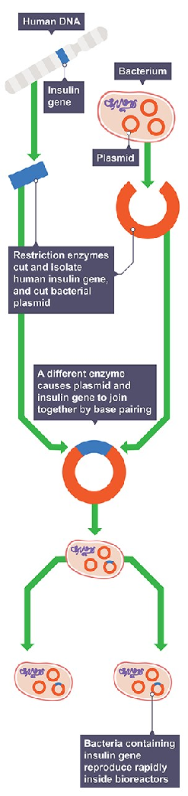

- 10.4.3 Food processing

Biotechnology plays a key role in the large-scale production of fermented foods like yoghurt, cheese, probiotics, buttermilk, idli, dosa, and dhokla. These products gain improved taste, enhanced nutrition like probiotics for gut health, added vitamins, and longer shelf life (via controlled microbial action). Microorganisms like Lactobacillus and yeasts are carefully selected, fermented under optimized conditions, and preserved to produce these foods safely and on a large scale.

- 10.4.4 Bio-Enzymes: Revolutionizing Household Cleaning

Biotechnology enhances household products through bio-enzymes, natural proteins derived from microbes like bacteria and fungi. These enzymes, such as proteases, amylases, and lipases, power everyday cleaners like laundry detergents, dishwashing liquids, and stain removers by breaking down tough dirt, grease, fats, and proteins at low temperatures—saving energy and reducing harsh chemical use. For instance, in washing powders, bio-enzymes target food stains or grass marks effectively, while in drain openers, they dissolve organic clogs safely without damaging pipes. This makes cleaning eco-friendly, skin-safe, and highly efficient for routine chores.

- 10.4.5 Environmental protection

Biotechnology contributes to environmental protection through targeted applications like bioremediation and biofuels.

Bioremediation

Microbes, engineered bacteria, or fungi break down pollutants such as oil spills, heavy metals, and pesticides in soil and water. This natural process restores ecosystems without harsh chemicals—for example, Pseudomonas bacteria degrade hydrocarbons from industrial waste.

Biofuels

Microbial fermentation converts biomass into renewable fuels like ethanol, biodiesel, or biogas. These alternatives reduce fossil fuel use and greenhouse gas emissions—algae systems even capture CO2 while growing, aiding cleaner energy and waste management.

##### 10.5. Bioreactors: Powering Large-Scale BiotechnologyApplications

Biotechnology's diverse applications—from medicine and agriculture to food production—rely on scalable tools like fermenters (bioreactors) for industrial efficiency.

###### Fermenters (Bioreactors)

Fermenters are large vessels (up to 100,000 liters) made up of glass or steel that are used to grow microorganisms so as to produce a desired product. Example- A small culture of bacteria or yeast (inoculum) is added to fermenters containing nutrient medium to get useful products on a large scale.

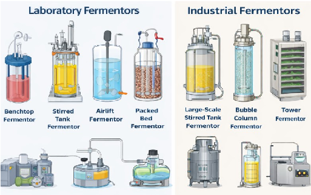

Figure 4: Fermenters in Laboratory and Industry

Fermenters must be sterilized before use so as to avoid the contamination of the rich nutrient culture.

- 10.5.1 Parts of fermenter-

-  Stirrer (Impeller)- helps in agitation, i.e., mixes broth so that every cell gets the nutrients and oxygen.
-  Sparger- Helps in aeration into the tank for the microbes to facilitate aerobic respiration.
-  Cooling Jacket- Acts as a temperature control when microbes produce heat as they grow. The "cooling jacket" filled with cold water surrounds the tank to prevent the microbes from "cooking" themselves.
-  pH sensors- Sensors monitor the change in pH. If the broth becomes too acidic, the system automatically adds a "base" to neutralize it.

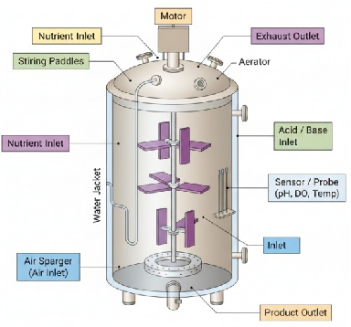

Figure 5: Parts of a fermenter

- 10.5.2 Fermentation Process Preparation of Culture Medium

↓ Sterilization of Medium and Equipment

↓ Preparation of Pure Microbial Culture (Inoculum) ↓ Growth of Microorganisms in a Fermenter (Under Controlled Conditions) ↓ Extraction and Purification of Product ↓ Treatment and Disposal of Waste Materials

Quick Check

- 1. Why is temperature control important in fermenters?
- 2. What happens if contamination occurs?
- 3. Explain sterilization and its importance in microbial growth.

- 10.5.3 Growth of Microorganisms in a Fermenter

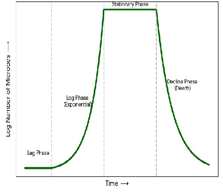

Microbial growth does not occur at a constant rate. When nutrients are supplied in a fermenter, microbes pass through different phases of growth, which together form a growth curve.

The following are the phases of growth-

Lag Phase: The new inoculum is added to the nutrients in the fermenter, and the microbes adapt to the new environment. This phase is also called the acclimatization phase.

Figure 6: Microbial growth curve

Log Phase: During this phase, microbial cells divide at their optimal rate, resulting in rapid population growth and maximum product formation. This phase is known as the exponential phase.

Stationary Phase: This phase is also known as the Survival Phase, wherein nutrients in the fermenters start depleting, and metabolic waste starts building up. Although new cells are being produced, an equal number of cells are dying.

Decline (Death) Phase or The End phase: The toxic waste levels become too high in the fermenter, and the population crashes.

To avoid the Decline (Death) Phase in a fermenter, engineers use a Continuous Culture system. Instead of a closed "batch," the environment is actively managed by:

 Nutrient Replenishment: Fresh nutrient medium is added continuously to ensure the microbes never run out of "fuel" for growth.

 Waste Removal: An equal volume of "spent" broth (containing toxic metabolic waste) is removed simultaneously. This prevents the buildup of toxins that would otherwise harm the population.

 Steady State: Nutrient replenishment and waste removal keep the microbes locked in the Log Phase, where they are most productive.

 Automatic Buffering: Sensors detect changes in pH and temperature. If acidic waste builds up, a base is automatically added to maintain a stable, lifesupporting environment.

Let us explore like a scientist Activity 5.4: Growth Simulation

The following table shows hypothetical data representing the growth of microorganisms in a fermenter.

|Time (hours)|Number of Microorganisms|
|---|---|
|0|10|
|2|12|
|4|25|
|6|60|
|8|120|
|10|125|
|12|123|
|14|90|

- 1. Using the above data, plot a graph using time (hours) on the X-axis and number of microorganisms on the Y-axis.
- 2. Identify and label the following growth phases on the graph:

-  Lag phase
-  Log phase
-  Stationary phase
-  Death phase

- 3. During which time period do microorganisms grow most rapidly?
- 4. Suggest one reason why the population decreases after a certain time.

##### 10.6 Ethical Issues in Biotechnology

- 10.6.1 Safety: The risk of "Super-bugs" and ecological imbalance

When we try to engineer a microbe to kill a pest or to modify or extract proteins, we are actually introducing a new variable in the ecosystem. This may lead to unintended consequences and require biosafety measures.

Example-

 Gene Flow: Modifying genes could mix into the wild through crosspollination in plants and lead to a risk that will be difficult to control. For example, a "weed-killer resistant" gene from a crop could transfer to a wild weed, creating a "super-weed" that no one can kill.

 Targeting the Wrong Organisms: A toxin meant to kill one specific pest might accidentally harm beneficial insects, like bees or butterflies, disrupting the entire food chain and food web.

 Evolutionary Pressure: Just as bacteria become resistant to antibiotics, pests can become resistant to the toxins in GM crops (like Bt Cotton), leading to the rise of "super-bugs" that are harder to control than ever before.

- 10.6.2 Equity: The Global "Biotech Divide"

Science is expensive. Because of the high cost of research and development, biotechnology is often regulated by a few powerful corporations and wealthy nations.

 Patent Control: Companies often "own" the seeds or the processes they create through patents. This can prevent poor farmers in developing countries from saving seeds for the next year, forcing them to buy new, expensive seeds every season.

 Biopiracy: This happens when researchers do unethical or unlawful appropriation or commercial exploitation of biological materials (such as medicinal plant extracts) that are native to a particular country or territory without providing fair financial compensation to the people or government of that country or territory.

 Health Access: Benefits of biotechnology may not reach the middle-income people, as the process and products developed are expensive and may only reach up to the top 1% of the global population, widening the gap between the rich and the poor.

|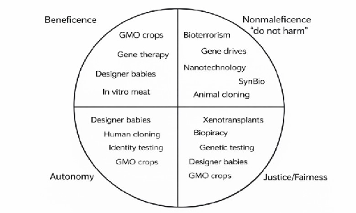  Think and Discuss  There are four important ethical principles that help evaluate the impact of biotechnology on society. These principles act as guidelines to understand the benefits, risks and fairness related to emerging biotechnologies.  The figure shows different modern biotechnologies placed under four ethical principles:   Beneficence (Doing Good)   Non-maleficence (Do Not Harm)   Autonomy (Freedom of Choice)   Justice and Fairness  Each emerging biotechnology has been grouped under the principle where ethical concerns may arise. (SynBio refers to Synthetic Biology.)  |
|---|

Check Your Understanding

- 1. Define biotechnology. Explain how microorganisms act as “life’s engineers” giving two examples.
- 2. Differentiate between traditional biotechnology and modern biotechnology using suitable examples.
- 3. Why are fermenters used instead of open containers for industrial production of useful substances? Give any two reasons.
- 4. Explain the importance of maintaining sterility inside a fermenter. What problems may arise if sterility is not maintained?
- 5. Study the diagram of a fermenter in the chapter and answer the questions. A. Identify any two parts responsible for maintaining microbial growth. B. What is the function of the stirrer in a fermenter? C. Why is oxygen supply important in some fermenters?
- 6. The following data shows the number of microorganisms growing in a fermenter.

|Time (hours)|Number of Microorganisms|
|---|---|
|0|20|
|2|30|
|4|70|
|6|140|
|8|145|
|10|140|
|12|90|

Answer the following: a) During which time period does rapid microbial growth occur? b) Identify the stationary phase from the data. c) Suggest one reason why the microbial population decreases after a certain

time.

- 7. Microbes are used in food production, medicine and environmental protection. Analyse how biotechnology helps improve human life using any three examples.
- 8. A scientist wants to produce insulin using bacteria. Explain how modern biotechnology makes this possible. Why has traditional biotechnology not achieved this?
- 9. Biotechnology has helped increase food production, but some people have ethical concerns regarding GM crops. Evaluate both advantages and concerns.
- 10. Design a simple biotechnology product that can help solve an environmental problem in your community. Describe:

 The microorganism or enzyme you would use  The problem it solves  How it benefits society

- 11. Which of the following is an example of traditional biotechnology? a) Production of insulin using bacteria b) Preparation of curd from milk c) Development of disease-resistant crops d) Gene transfer between organisms
- 12. Which microorganism is commonly used in bread making?

a) Bacteria b) Virus c) Yeast d) Algae

- 13. Which of the following conditions is necessary for proper functioning of a fermenter?

a) Contamination b) Controlled temperature c) Open environment d) Absence of nutrients

- 14. Genetic engineering mainly involves:

- a) Mixing different foods
- b) Transfer of genes between organisms
- c) Increasing natural microbial growth
- d) Removing microorganisms from food

- 15. During which phase do microorganisms show maximum growth?

- a) Lag phase
- b) Log phase
- c) Stationary phase
- d) Death phase

Assertion (A): Sterility must be maintained inside a fermenter. Reason (R): Contamination by unwanted microorganisms can reduce product quality.

a) Both A and R are true and R is the correct explanation of A. b) Both A and R are true but R is not the correct explanation of A. c) A is true but R is false. d) A is false but R is true.

Assertion (A): Modern biotechnology allows production of insulin using bacteria Reason (R): Modern biotechnology involves genetic modification techniques.

- a) Both A and R are true and R is the correct explanation of A.
- b) Both A and R are true but R is not the correct explanation of A.
- c) A is true but R is false.
- d) A is false but R is true.

References:

- 1. https://www.britannica.com/technology/biotechnology

- 2. https://www.researchgate.net/figure/There-are-four-ethical-principles-thatmay-be-used-as-guidelines-to-assess-the-ethical_fig3_316067580

- 3. https://agritech.tnau.ac.in/bio-tech/biotech_btcotton_env.html

- 4. https://www.sciencedirect.com/topics/engineering/fermenter

- 5. https://www.sciencedirect.com/topics/engineering/production-fermenter

- 6. https://ncert.nic.in/textbook.php?lebt1=2-13

- 7. https://www.cambridgeinternational.org/programmes-andqualifications/cambridge-igcse-biology-0610/

- 8. https://bio.libretexts.org/Bookshelves/Human_Biology/Human_Biology_(Wa kim_and_Grewal)/06%3A_DNA_and_Protein_Synthesis/6.08%3A_Biotechn ology

- 9. https://pmc.ncbi.nlm.nih.gov/articles/PMC1868753/

- 10.https://www.cdc.gov/ecoli/about/index.html

- 11.https://media.sciencephoto.com/f0/30/28/70/f0302870-800px-wm.jpg

- 12.https://www.bbc.co.uk/bitesize/guides/zr3f7nb/revision/2

- 13.https://www.merriam-webster.com/dictionary/biopiracy

- 14. Biotechnology – Textbook for class XI (NCERT Publication)

************************************************************************************************

